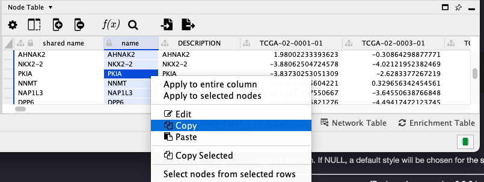

# Answers

## Exercise 2-A 

* When the enrichment analysis is complete, a new tab titled **STRING** **Enrichment** will open in the **Table Panel**.  
      

      
  
  
* At the top left of the STRING enrichment tab, click the filter icon `r icons::fontawesome("filter", style = "solid")` . Select **GO Biological Process** and check the **Remove redundant terms check-box**. Then click **OK.**  
* Next, add a split donut chart to the nodes representing the top terms by clicking on   
* Explore custom settings via   in the top right of the STRING enrichment tab.  
        
    
    
### Export your Networks

Cytoscape provides a number of ways to save results and visualizations:   

* As a session: **File → Save Session, File → Save Session As...**   
* As an image: **File → Export → Network to Image...**   
* As a graph format file: **File → Export → Network to File.**   
  * **Formats:**   
  *  **CX JSON / CX2 JSON**   
  * **Cytoscape.js JSON**   
  * **GraphML**   
    

## Exercise 2-B

* Find significant expression changes in **Cluster 1**   
**Hint:** We are going to repeat step 4 with "Cluster 1 Mean log2FC" as the column. This represents the mean expression across the samples in cluster 1 (the leftmost cluster in the previous figure).

Open the **Filter** tab and setup two **Column Filters** for the **"Cluster 1 Mean log2FC"** column, one for up and one for down. Select the **"Cluster 1 Mean log2FC"** column and set the values to be between **-5 and-1**, then add a second filter (be sure to specify **OR **at the top) and set the values between **1 and 5**.
This should result in a selection of 192 nodes.

  
* Download the PPI from STRING
From the above selection filter, we’ve identified 192 nodes that show an average **Log2FC greater than 5 or less than 1**, and selected those nodes. Now, we create a separate network that includes all of those 192 nodes by selecting the **"Create Network from selected nodes and edges option"** and then load the protein-protein interaction data from **STRING.** Note that only the selected nodes are shown in the **Table Panel**.

## **Select gene names from Table Panel.** 
* Select everything in the **name** column by clicking into the first cell and then dragging down until you get to the bottom. Then, do a copy **(Control-C or Apple-C).**

 
  

* **Paste gene names into STRING network search**. In the **Network** tab of the **Control Panel** at the top should be a text field with an icon at the left. Click on that icon and select **STRING protein query**. (If you don’t see any **STRING** options, the **stringApp** hasn’t been loaded and needs to be loaded from either the App store or Cytoscape options menu.) Then click into the text field and paste the list of genes.

  

* **Set STRING search parameters.** Next to the text field is a menu with a list of options. Change the **Confidence (score) cutoff** to 0.8 and the **Maximum additional interactors** to 30. This will get only high quality results (80% confidence) and add 30 extra proteins to the network.

  

## **Create the network.** 
Click on the search icon (magnifying glass) to load the network. The network should appear similar to the figure below.

 
    
* Style the network to show differential expression.
In this step, we’ll change the style of the network to highlight the differentially expressed genes.

   

## Exercise 3-A

# Walk-through exercise

For the exercise, we are going to use mRNA bladder cancer data generated from RNA-Seq platform. The data can be retrived from Robertson et al. Cell 2017 or downloaded from ([Here..](https://github.com/a1aks/Cytoscape_Course/tree/main/Data_Files)) 

## ClueGO settings

* set the type of analysis: Compare Cluster
* select the organism: Homo Sapiens and the the type of ids used: AccessionID
* load sample gene lists:
  * **choose Cluster #1**: select Top_Down_genes_BLCA_Session3.txt - ([Here..](https://raw.githubusercontent.com/a1aks/Cytoscape_Course/main/Data_Files/Top_Down_genes_BLCA_Session3.txt))
  * **choose Cluster #2**: Top_Up_genes_BLCA_Session3.txt - ([Here..](https://raw.githubusercontent.com/a1aks/Cytoscape_Course/main/Data_Files/Top_Up_genes_BLCA_Session3.txt))
* select the Ontologies:
  * GO BiologicalProcess,
  * KEGG Pathways  and
  * BioCarta pathway reactome 
* select the statistical test: **Enrichment/Deplection (Two sided hypergeometric test)**, **FisherExactTest**
* select the correction method: **Bonferroni**
* click Show Advanced Settings
* set GO Tree Level: Min 4 and Max 5
* set the selection criteria for the terms that have associated genes from cluster 1: min 2 genes/term
and minimum 4% from all the Genes associated with the term
* select OR (e.g. min 2 genes from cluster #1 or min 2 genes from cluster #2)
* set is specific to 66% (if 66% or the genes associated with the term are from cluster #1, the term
is considered specific for this cluster)
* set the selection criteria for the terms that have associated genes from cluster 2: min 2 genes/term
and minimum 4% from all the Genes associated with the term
* select Use GO Term Grouping
* select Fix Group coloring
* select Leading Group Term based on Highest Significance
* select Kappa Score grouping with 3 terms in initial group and 50% overlap for groups to merge
* select ShowDifference
* Start

## Customize the network using Cytoscape features

* select **Style** (Cytoscape Control Panel)
* select Node Font Size
* set the value of FALSE (size for the name of the terms) to 0.001 and press Enter
* set the value of TRUE (size for the name of groups) to 26 and press Enter
* select Layout (Cytoscape menu bar)
* set scale to 1/3
* zoom the image
* change the position of the leading terms to make visible the name of the group
* change the possition of notgrouped terms if due to rescaling they are too close to a group
* for visualizing groups press Show Groups

* Using the filters and style options above, develop a network by using cluster compare for the two bladder cancer conditions - Normal VS Tumor. 

* Save your network in two formats: (a) as a Cytoscape Session (**.sys ** format), and  (b) as a **.png or .pdf** figure.
  * The cytoscape session (.sys) will be used in the next section for CluePedia analysis. 

More details on using specific options can be achieved by folowing the **ClueGO** documentation: http://www.ici.upmc.fr/cluego/ClueGODocumentation2019.pdf

  

