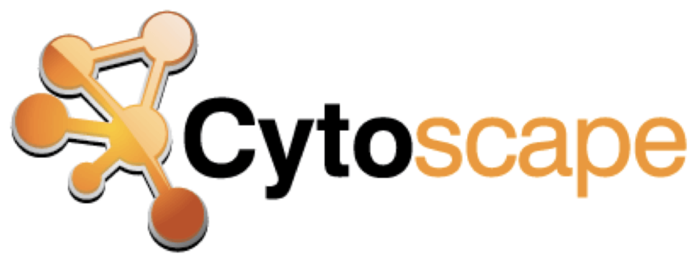

# Analysis of next-generation sequencing data using **Cytoscape**





## Workshop Information
- June 12th 2024 - University of Sheffield
- Bartolome House, Seminar Room EG03

## Schedule (Provisonal)

### Thursday 12th June, 2024

- 09:30 - 11:00 Introduction to Cytoscape and it's App
- 11:15 - 12:30 Functional Enrichment Analysis
- 12:30 - 13:15 LUNCH
- 13:15 - 15:00 Enrichment using ClueGO and CluePedia
- 15:00 - 16:30 Identifying signiifcant pathway modules and differential expression genes


You will need to attend all sessions to complete the workshop


***Some basic Network Biology knowledge is assumed (and is essential). Without it, you will struggle on this course. If you are not familiar with the key terms. We strongly encourage you to work through an introductory Cytoscape course before attempting these materials. We recommend reviewing Parts 1 and 2 of our Cytoscape introductory course before deciding if you can attend***

- [Cytoscape crash course Part 1](session1a.nb.html)
- [Cytoscape crash course Part 2](session2a.nb.html) 

## Registration Link

You can sign-up to attend either in-person or online using this link

- [https://onlineshop.shef.ac.uk/conferences-and-events/faculty-of-medicine-dentistry-and-health/medical-school](https://onlineshop.shef.ac.uk/conferences-and-events/faculty-of-medicine-dentistry-and-health/medical-school)

If you are registering to attend as a University of Sheffield staff or student, you will be prompted for a password. This should have been sent to you in an announcment email.


## Materials

This course comprises of three sessions. 
- [Session 1:A - Introduction to Cytoscape and it's App - Part 1](session1a.Rmd)
- [Part 1:A - HTML](session1a.nb.html)
- [Session 1:B - Introduction to Cytoscape and it's App - Part 2](session1b.Rmd)
- [Part 1:B - HTML](session1b.nb.html)
- [Session 2:A - Basic network analysis using RNA-Seq data](session2a.Rmd)
- [Part 2:A - HTML](session2a.nb.html)
- [Session 2:B - Functional Enrichment Analysis](session2b.Rmd)
- [Part 2:B - HTML](session2b.nb.html)
- [Session 3 - Enrichment using ClueGO and CluePedia.](session3.Rmd)
- [Part 3 - HTML](session3.nb.html)


## Overview

In this workshop, you will be learning how to analyse RNA-seq count data, using R. This will include reading the data into R, quality control and performing differential expression analysis and gene set testing, with a focus on the DESEq2 analysis workflow. You will learn how to generate common plots for analysis and visualisation of gene expression data, such as boxplots and heatmaps. You will also be learning how alignment and counting of raw RNA-seq data can be performed in R. This workshop is aimed at biologists interested in learning how to perform differential expression analysis of RNA-seq data when reference genomes are available.

## Who should attend this course?

Researchers in life sciences who want to get an appreciation for the computational steps involved in RNA-seq analysis, and how to execute best-practice RNA-seq workflows in R.

## Objectives:- After this course you should be able to:

- Design properly your RNA-Seq experiments considering advantages and limitations of RNA-seq assays
- Assess the quality of your datasets
- Know what tools are available in Bioconductor for RNA-seq data analysis and understand the basic object-types that are utilised
- Produce a list of differentially expressed genes from an RNA-seq experiment 

## Aims:- During this course you will learn about:

- RNA sequencing technology and considerations on experiment design
- Sources of variation in RNA-seq data
- Differential expression analysis using DEseq2
- Annotation resources in Bioconductor
- Identifying over-represented gene sets among a list of differentially expressed genes 
    
## Software installation

You will need to bring an internet-enabled laptop to the course and install the latest versions of both R ***and*** RStudio before coming to the course

1) Install R and RStudio 

### Windows

Install R by downloading and running [this .exe](http://cran.r-project.org/bin/windows/base/release.htm) file from CRAN. Also, please download and run the [RStudio installer for Windows](https://www.rstudio.com/products/rstudio/download/#download). Note that if you have separate user and admin accounts, you should run the installers as administrator (right-click on .exe file and select “Run as administrator” instead of double-clicking). Otherwise problems may occur later, for example when installing R packages.

### Mac

Install R by downloading and running [this .pkg](http://cran.r-project.org/bin/macosx/R-latest.pkg) file from CRAN. Also, please download and run [the RStudio installer for Mac](https://www.rstudio.com/products/rstudio/download/#download)

### Linux

You can download the binary files for your distribution from CRAN. Or you can use your package manager (e.g. for Debian/Ubuntu run `sudo apt-get install r-base` and for Fedora run `sudo yum install R`). Also, please download and run the [RStudio installer](https://www.rstudio.com/products/rstudio/download/#download).

2) Install the R packages required for the course

Enter the following into the console prompt in RStudio
```
source("https://raw.githubusercontent.com/sheffield-bioinformatics-core/rnaseq-r-online/main/install_bioc_packages.R")
```

You can check that this worked by running

```
source("https://raw.githubusercontent.com/sheffield-bioinformatics-core/rnaseq-r-online/main/check_packages.R")

```

3) Download and unzip this file containing the data for the course

- [Link to Data](https://drive.google.com/file/d/178yZSaG1tTr3akeN0DQ2f1Pu2rMoJkBT/view?usp=sharing)


4) (Optional) Watch these short introductory videos

- [A gentle introduction to RNA-seq](https://youtu.be/tlf6wYJrwKY)
- [RNA-seq count normalisation explained](https://youtu.be/TTUrtCY2k-w)

## Instructors

- Dr. Mark Dunning, Bioinformatics Core Director
- Dr. Emily Chambers, Bioinformatics Core Scientist
- Dr. Akshay Bhat, Cancer Bioinformatician
- Lara Oberski, PhD Student


## Timetable (provisional)

- Session 1 Monday 6th November 13:00  13:00 - 16:00
  + Importing RNA-seq counts into R
  + Quality assessment of raw counts
  + Checking sources of variation using PCA and clustering
  
- Session 2 Wednesday 8th November 13:00 - 16:00
  + Differential expression using DESeq2 to generate gene-lists
  + Manipulating and filtering gene-lists
  + Basic plotting of differential-expression results
  + More-advanced designs using DESeq2
  
- Session 3 Friday 10th November 13:00 - 16:00
  + Advanced plotting with heatmaps
  + Using Bioconductor resources to interrogate Gene Ontologies
  + Identifying over-represented and enriched gene sets
  
## Feedback


