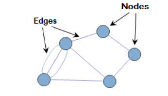
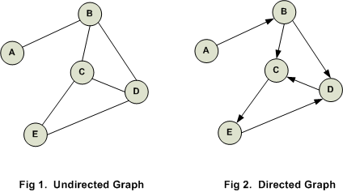
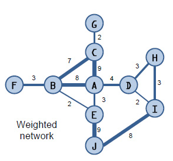
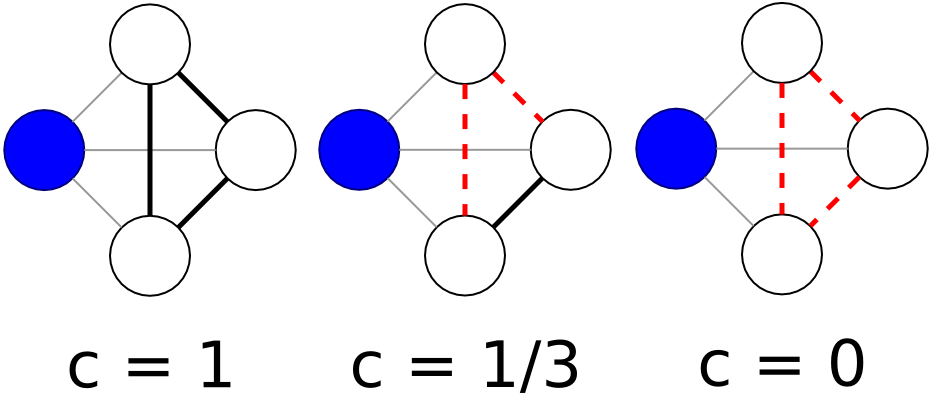

# Analysis of next-generation sequencing data using **Cytoscape**

## Date and Venue
- June 12th 2024 - University of Sheffield
- Bartolome House, Seminar Room EG03

# Course Overview
The workshop is designed to give you an introduction to using Cytoscape, which is a network-based software application to perform bioinformatics data and pathway enrichment analysis. The particular use-case in this course is that of RNA-seq data, but many of the concepts are used for other types of **omics**-analysis. There are several reasons why we might want to use **Cytoscpae** in **Bioinformatics**:-
* You can be a naive or non-programmer for analysing your biological datasets generated by “high-throughput sequencing” thorugh dedicated Cytoscape packages.
* The **packages/Apps** within Cytoscape provide a user complete support for different types of “-Omics” datasets.
 *	e.g. many NGS tools are developed for a Unix environment.
* Some tasks require more memory (RAM) and processor speed than we have on our own machine
* Some analyses take too long, and whilst they are running everything else on our machine will be slow.
* Eventually you will want to use “High-performance computing” (HPC) - but this requires some background knowledge before you can use it.
* Hence, **Cytoscape** provides many advantages for those users who wish to have their biological data analysed in a more user-freindly manner but also visualizing results simultaneously. 

## Creating Network Graphs with Cytoscape

**Cytoscape** is a tool for viewing and analysing networks (meaning, in this case, any group of entities that are connected in some way). Cytoscape is not too hard to use, but it won't make much sense unless you have a sense of some basic network analysis vocabulary and concepts. A glossary is made below for basic understanding of introduction to network graphs. 
* https://github.com/miriamposner/network_analysis_workshop/blob/master/social-network-glossary.md

## **Social Network Analysis Glossary**

*Adapted from*

Brian V. Carolan, “Key Terms,” *Social Network Analysis and Education:
Theory, Methods & Applications* (SAGE, 2014,
http://www.sagepub.com/carolan/study/materials/KeyTerms.pdf);

Datavu, “Introduction to Network Analysis terminology”
(<http://datavu.blogspot.com/2013/10/sna-social-network-analysis-basic.html>);

Katharina Zweig, “An Introductory Course on Network Analysis”
(<https://sites.google.com/site/networkanalysisacourse/schedule/an-introduction-to-centrality-measures>).

## **Basic Terms**

**Social network**

A finite set (or sets) of features (a.k.a. biological entities, for e.g. genes, mRNAs, miRNAs, proteins, peptides, metabolites, etc.) and the relations (for e.g. co-expression) defined on them. It
consists of three elements: (1) a set of biological entities; (2) each bio-entity has a
set of individual attributes; and (3) a set of ties that defines at
least one relation among features.

**Graph**

A common way to visually represent biological networks, consisting of two
dimensions: bio-entity and relations (also called nodes and edges).

**Node**

Nodes are the entities in graph (also called vectors). For example, if
we consider DNA-Damage Repair (DDR) pathways as a graph, then every gene/pathway-term is a node.

**Edge**

These are the relationships between nodes. For example, if we consider
Extracellular-Matrix regulation as a graph then every activation/inhibition of gene1-gene2 pair is an edge.

 

## **Types of Graphs**

**Undirected graph**

When the relationship is always valid in both directions, then it is
called **undirected graph**. For e.g. If gene-1 **TP53** is inhibiting gene-2 **RB1** within a cell-regulatory network, then
RB1 is also activating TP53.

**Directed graph**

When the relationship may not be valid in both directions (connecting
nodes), then it is called a **directed graph**. If FGFR3 is associated to ERBB2
within a chromosomal abberation event and ERBB2 is not having any association to FGFR3, then relationship is
directed.

**Weighted network**

A network in which the edges between nodes have weights (corresponding
to, e.g., the strength of a relationship) assigned to them.

**Unweighted network**

A network in which the edges between nodes do not have weights assigned
to them.

## **Measures of Graphs or Nodes**

**Size**

A measure of the number of genes (nodes) in a complete or sub-graphed network.

**Density**

The number of ties in the network reported as a fraction of the total
possible number of ties.

**Reciprocity**

The proportion of mutual ties in a network.

**Distance**

The number of “steps” between any two genes (nodes) in a biological network.

**Clustering coefficient**

A measure of a network’s genes’ tendency to “group together” into
pockets of dense connectivity.

*In the first image, the blue node has a
clustering coefficient of one, because all possible connections among
its neighboring nodes have been realized. In the second image, only one
of the possible connections has been realized — so the blue node has a
clustering coefficient of 1/3. In the third image, none of the
neighboring nodes are connected, so the blue node has a clustering
coefficient of 0.*

**Centrality**

There are multiple ways to determine a node’s importance, or centrality.
The measure you use depends on how you define centrality. Several of
these measures are:

**Degree centrality**
*An important node is involved in large number of interactions.* The number of edges connected with a particular node.

**Eigenvector centrality**
*An important node is connected to important neighbors.* This is a
measure of influence of a given node in the whole network. The notion
is how well-connected a given node is with other well connected nodes
in the network. This is how, for example, Google determines page rank.

**Betweenness centrality**
*An important node lies on a high proportion of paths between other
nodes in the network.*

**Closeness centrality**
*An important node is typically “close” to, and can communicate quickly with, the other nodes in the network.* Length of the average shortest path between a given node and all other nodes in a graph.

## More resources 
* https://journalofdigitalhumanities.org/1-1/demystifying-networks-by-scott-weingart/

What is this?

These tutorials provide a basic introduction to using Cytoscape to conduct network analysis of biological data. They're intended to be used with the data my students and I collected about early African-American silent film. However, anyone should be able to follow along.

Here's what's included:
•	Creating a basic Cytoscape network (that's this tutorial)
•	Importing a node list and working with node attributes
•	Selecting parts of your network 
•	Publishing your network diagram

1.	Setting up your data

The most important thing to understand about Cytoscape (or, really, most network analysis tools) is the format in which you need to structure your data. At its most basic, Cytoscape wants a spreadsheet containing two columns. The objects in the first column should be connected in some way to the objects in the second column. This is called an edge list. In the example below, my edge list contains two kinds of things: geneA and geneB. The columns could be reordered so that the geneB column precedes the geneA column; it doesn't matter. All that matters here is that each row in my spreadsheet describes a connection between two entities.
Other kinds of relationships you could describe in an edge list:
•	Gene A appears in a pathway with Gene B.
•	Gene A activates Pathway A.
•	Gene B supresses Pathway A.
... and on and on. The important thing here is that your edge list should contain a list of relationships between, at most, two kinds of entities (e.g., geneA and geneB, features and pathways). The nature of those relationships can differ. For example, Gene A could have up-regulated Pathway A, while Gene B down-regulates Pathway A. But there should be two different kinds of things, at most, described in two columns.

If you need specific guidance on setting up your edge list, see Preparing Data 1: Making an Edge List. This is just an example using actors and films as data. 
You can save your spreadsheet as an Excel document (with the file extension .xls) or its generic equivalent, a CSV (with the file extension .csv). Cytoscape can interpret both of these formats.
If you don't have your own data, you can use the sample edgelist included in this tutorial below. (Use the "raw" download link or download the CSV directly.). This data was taken from our previous published article on bladder cancer muscle invasiveness link: https://content.iospress.com/articles/bladder-cancer/blc150024. 
 

2.	Get your edge list into Cytoscpae
Open up Cytoscape. You should be greeted with a welcome pane that looks something like the one below. (If not, read on for instructions on how to accomplish the same thing without the welcome screen.)
Start a new session From Network File. Somewhat confusingly, Cytoscape considers your edge list a "network file." I guess it is a network, so maybe it's not that confusing. Anyway, press the From Network File button and select the edge list you've prepared. You can also directly drag your .CSV file into Cytoscape network. 
 

3.	If you don't see that welcome screen...
no big deal. Someone might have disabled it, but you can accomplish the same thing by clicking on the Import Network from File button (circled below) and selecting your edge list.

 

4. Help Cytoscape understand your data
The screen that pops up after you imported your edge list might be the most initially confusing part of Cytoscape, although it's no problem once you figure out what it wants. You need to tell Cytoscape which parts of your data constitute the entities in your network diagram.
Cytoscape hasn't understood right away that you want a network composed of geneA and geneB nodes. You can tell that's the case because the icon that appears next to the words gene symbol A and Interaction Type looks sort of like a document, which means that Cytoscape thinks that you've fed it a list of edge attributes, not edges themselves. Edge attributes can come in handy, as I'll explain below, but that's not what you've provided Cytoscape at the moment.
We need to tell Cytoscape that the edge list we've provided contains Sources in one column and Targets in another. It doesn't matter, in this case, which column you designate a source and which column you designate a target; it's just that one column has to be one and the other has to be the other. (If our network was directed, this would matter, but that's more information than you need right now.)
OK, let's tell Cytoscape how to interpret our data. Click on the arrow next to the word Gene Symbol A and from the menu that appears, select the green circle. Cryptically, this icon means Source. For the Gene Symbol B column, do the same thing, but this time select the red bullseye, which means Target.
When you've changed both columns, click OK.
 

5. You have a (very confusing) network!
If the previous steps worked properly, you should have a network of connected nodes. If you have more than 100 or so, though, your network will look a lot like a hairball. We'll talk about ways to make your network graph more legible in subsequent steps
For now, note that you can zoom in on parts of your network using the magnifying glasses or your mouse. On a Mac, you can move your canvas around if you hold down the command key and drag. You can also search for individual nodes by using the search box at the upper right of the window. (Note that Cytoscape doesn't zoom to the node you searched for right away; it just highlights it in yellow. You may have to zoom out to see the selected node.).
 
6. Switch up your style
One of the easiest ways to change the look of your network diagram is to switch the style using one of Cytoscape's built-in options. To do that, click the Style tab on the control panel and then choose one of the options with which you're presented. I don't know if I love any of them, but some are more legible than others.

7. Change your layout
Sometimes networks are more legible if you change the arrangement of the nodes. You can do this by switching the layout. Click on Layout from Cytoscape's menu bar and select one of the layout options. Experiment with various layouts and notice how drastically your network diagram changes.
Confoundingly, each of these wildly different network layouts displays the same basic information. How can this be? Simple: In most network graphs, the proximity of two nodes doesn't indicate anything except legibility. This can be really confusing, because cognitively, we expect proximity to convey meaningful information. It just doesn't, though, in most network diagrams. The presence or absence of an edge means something, and color and size often do, too. But proximity generally doesn't.
 
8. Customize your style
You can make changes to many visual attributes of your network graph from Cytoscape's control panel. Once you've selected the Style tab, look at the bottom of the control panel. You'll see that three additional buttons allow you to customize the look of the nodes, the edges, and the network as a whole.
Looking at the Node style pane, you'll see that we can alter many aspects of our nodes, including their border, the color, height, labels, etc. But what do the three columns, labeled Def., Map., and Byp. mean?
Def. stands for default: the default visual attribute of a node. If you click on the default fill color for your network diagram, for example (in the image below, it's a blue square), you'll see that you can swap out the colors of your network's nodes.
Byp. stands for bypass, and it allows you to apply a style to a group of nodes that you select.
The Map. (mapping) column allows you to control the visual features of your nodes according to their properties. For example, let's say you'd like all of the films from a particular studio to appear in pink. You can do that by mapping that attribute to a particular color. Or, let's say you'd like those nodes with more connections to appear larger. You can do that with the mapping control.
The problem is, we don't have any of that information currently included in our network. So in the next tutorial, we'll look at how to load up attributes for our nodes.
(Or you can skip straight to publishing your network diagram!)

 

9. Saving your network
Cytoscape provides a number of ways to save results and visualizations:
As a session: File → Save Session, File → Save Session As...
 

As an image: File → Export → Network to Image...
 
 
To the web: File → Export → Network to Web Page...
To a public repository: File → Export → Network to NDEx
As a graph format file: File → Export → Network to File.
Formats:
CX JSON / CX2 JSON
Cytoscape.js JSON
GraphML
PSI-MI
XGMML
SIF

## Schedule (Provisonal)

### Monday 30th January, 2023

- 09:30 - 11:00 Introduction to Cytoscape and it's App
- 11:15 - 12:30 Functional Enrichment Analysis
- 12:30 - 13:15 LUNCH
- 13:15 - 15:00 Enrichment using ClueGO and CluePedia
- 15:00 - 16:30 Identifying signiifcant pathway modules and differential expression genes

## Materials

This course comprises of three sessions. 
- [Session 1 - Introduction to Cytoscape and it's App](session1.Rmd)
- [Part 1 - HTML](session1.nb.html)
- [Session 2 - Functional Enrichment Analysis](session2.Rmd)
- [Part 2 - HTML](session2.nb.html)
- [Session 3 - Enrichment using ClueGO and CluePedia.](session3.Rmd)
- [Part 3 - HTML](session3.nb.html)

## Course coordinator - Dr. Akshay Bhat
## Last modified: 2nd April 2024
