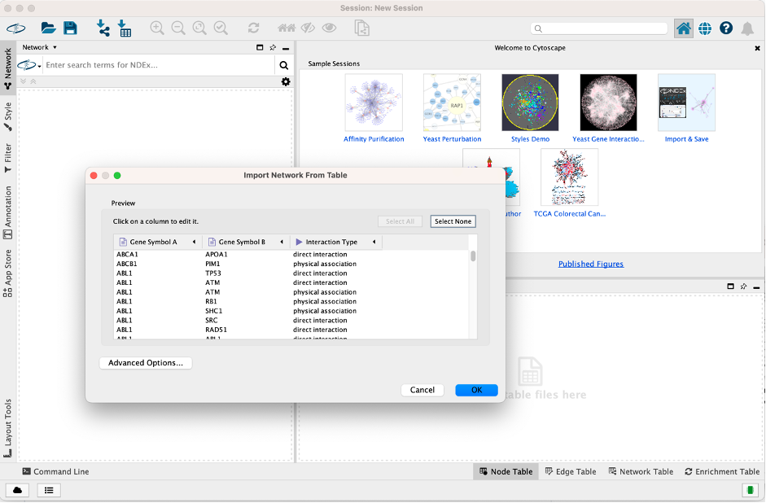

# Part A:

# Course Overview

The workshop is designed to give you an introduction on using **Cytoscape** – a network-based software application to perform bioinformatics pathway enrichment analysis. The particular use-case is that of RNA-seq data, but many of the concepts are used for other types of analysis. There are several reasons why we might want to use Cytoscpae in Bioinformatics:-   
* You can be a non-programmer and want to analyse your biological datasets generated by “high-throughput sequencing”.

## Cytoscape packages.
* The packages within Cytoscape provides a user complete support for different types of “-Omics” datasets. 
  *	e.g. many NGS tools are developed for a Unix envi3
  
  +-----------------speed than we have on our own machine
*	Some analyses take too long, and whilst they are running everything else on our machine will be slow
*	Eventually you will want to use “High-performance computing” (HPC) - but this requires some background knowledge before you can use it

# Creating Network Graphs with Cytoscape

**Cytoscape** is a tool for viewing and analysing networks (meaning, in this case, any group of entities that are connected in some way). **Cytoscape** is not too hard to use, but it won't make much sense unless you have a sense of some basic network analysis vocabulary and concepts. A glossary is made below for basic understanding of introduction to network graphs. 

*	https://github.com/miriamposner/network_analysis_workshop/blob/master/social-network-glossary.md
*	https://journalofdigitalhumanities.org/1-1/demystifying-networks-by-scott-weingart/

## What is this?

These tutorials provide a basic introduction to using **Cytoscape** to conduct network analysis of biological data. They're intended to be used with the data I collected about bladder cancer muscle invasive phenotype. However, anyone should be able to follow along.

## Here's what's included:
*	Creating a basic **Cytoscape network** (that's this tutorial)
*	Importing a node list and working with node attributes
*	Selecting parts of your network 
*	Publishing your network diagram

In addition, you'll likely need to manipulate your data in order to work with it. To that end, I've provided two tutorials to help you set up your data:

*	**Preparing Data 1:** Making an Edge List.
*	**Preparing Data 2**: Making a Node List from an Edge List.

# Setting up your data
The most important thing to understand about Cytoscape (or, really, most network analysis tools) is the format in which you need to structure your data. At its most basic, Cytoscape wants a spreadsheet containing two columns. The objects in the first column should be connected in some way to the objects in the second column. This is called an **edge list**. In the example below, my edge list contains two kinds of things: **geneA** and **geneB.** The columns could be reordered so that the geneB column precedes the geneA column; it doesn't matter. All that matters here is that each row in my spreadsheet describes a connection between two entities.

Other kinds of relationships you could describe in an edge list:  
-	**Gene A** appears in a pathway with **Gene B**.  
-	**Gene A** activates **Pathway A.**  
-	**Gene B** suppresses **Pathway A.**  
... and on and on. The important thing here is that your edge list should contain a list of relationships between, at most, two kinds of entities (e.g., geneA and geneB, features and pathways). The nature of those relationships can differ. For example, Gene A could have up-regulated Pathway A, while Gene B down-regulates Pathway A. But there should be two different kinds of things, at most, described in two columns.

If you need specific guidance on setting up your edge list, see Preparing Data 1: Making an Edge List. This is just an example using actors and films as data.
You can save your spreadsheet as an Excel document (with the file extension .xls) or its generic equivalent, a CSV (with the file extension .csv). Cytoscape can interpret both of these formats.
      
If you don't have your own data, you can use the sample edgelist included in this tutorial below. ([Use the "raw" download link or download the CSV directly.]("https://github.com/a1aks/Cytoscape_Course/blob/main/Data_Files/interactions_data_BladderCancer_ABhatetal.csv")). This data was taken from our previous published article on bladder cancer muscle invasiveness link: https://content.iospress.com/articles/bladder-cancer/blc150024.       

  
  
  
  

# Get your edge list into Cytoscpae
Open up Cytoscape. You should be greeted with a welcome pane that looks something like the one below. (If not, read on for instructions on how to accomplish the same thing without the welcome screen.)

  

Start a new session **From Network File.** Somewhat confusingly, Cytoscape considers your edge list a "network file." I guess it is a network, so maybe it's not that confusing. Anyway, press the **From Network File** button and select the edge list you've prepared. You can also directly drag your .CSV file into Cytoscape network.
  

  
  

# If you don't see that welcome screen...
no big deal. Someone might have disabled it, but you can accomplish the same thing by clicking on the **Import Network from File** button (circled below) and selecting your edge list.

  
  

# Help Cytoscape understand your data
The screen that pops up after you imported your edge list might be the most initially confusing part of Cytoscape, although it's no problem once you figure out what it wants. You need to tell Cytoscape which parts of your data constitute the entities in your network diagram.
  
  
Cytoscape hasn't understood right away that you want a network composed of **geneA** and **geneB** nodes. You can tell that's the case because the icon that appears next to the words **gene symbol A** and **Interaction Type** looks sort of like a document, which means that Cytoscape thinks that you've fed it a list of **edge attributes**, not edges themselves. Edge attributes can come in handy, as I'll explain below, but that's not what you've provided Cytoscape at the moment.
  
  
We need to tell Cytoscape that the edge list we've provided contains **Sources** in one column and **Targets** in another. It doesn't matter, in this case, which column you designate a **source** and which column you designate a **target**; it's just that one column has to be one and the other has to be the other. (If our network was **directed**, this would matter, but that's more information than you need right now.)
  
  
OK, let's tell Cytoscape how to interpret our data. Click on the arrow next to the word **Gene Symbol A** and from the menu that appears, select the green circle. Cryptically, this icon means **Source.** For the **Gene Symbol B** column, do the same thing, but this time select the red bullseye, which means **Target.**
  
  
When you've changed both columns, click **OK.**

  
  

# You have a (very confusing) network!
If the previous steps worked properly, you should have a network of connected nodes. If you have more than 100 or so, though, your network will look a lot like a hairball. We'll talk about ways to make your network graph more legible in subsequent steps.
  
For now, note that you can zoom in on parts of your network using the magnifying glasses or your mouse. On a Mac, you can move your canvas around if you hold down the **command** key and drag. You can also search for individual nodes by using the search box at the upper right of the window. **(Note that Cytoscape doesn't zoom to the node you searched for right away; it just highlights it in yellow. You may have to zoom out to see the selected node.).**

  
  

# Switch up your style
One of the easiest ways to change the look of your network diagram is to switch the style using one of Cytoscape's built-in options. To do that, click the **Style** tab on the control panel and then choose one of the options with which you're presented. I don't know if I love any of them, but some are more legible than others.  
  

  
  

# Change your layout
Sometimes networks are more legible if you change the arrangement of the nodes. You can do this by switching the layout. Click on **Layout** from Cytoscape's menu bar and select one of the layout options. Experiment with various layouts and notice how drastically your network diagram changes.
  
  
Confoundingly, each of these wildly different network layouts displays the same basic information. How can this be? Simple: In most network graphs, the proximity of two nodes doesn't indicate anything except legibility. This can be really confusing, because cognitively, we expect proximity to convey meaningful information. It just doesn't, though, in most network diagrams. The presence or absence of an edge means something, and color and size often do, too. But proximity generally doesn't.
  
  

  
  

# Customize your style

You can make changes to many visual attributes of your network graph from Cytoscape's control panel. Once you've selected the **Style** tab, look at the bottom of the control panel. You'll see that three additional buttons allow you to customize the look of the **nodes**, the **edges**, and the **network** as a whole.
  
  
Looking at the **Node** style pane, you'll see that we can alter many aspects of our nodes, including their border, the color, height, labels, etc. But what do the three columns, labeled **Def., Map.,** and **Byp.** mean?
  
  
**Def.** stands for **default**: the default visual attribute of a node. If you click on the default fill color for your network diagram, for example (in the image below, it's a blue square), you'll see that you can swap out the colors of your network's nodes.
  
  
**Byp.** stands for **bypass**, and it allows you to apply a style to a group of nodes that you select.
  
  
The **Map.** (mapping) column allows you to control the visual features of your nodes according to their properties. For example, let's say you'd like all of the films from a particular studio to appear in pink. You can do that by mapping that attribute to a particular color. Or, let's say you'd like those nodes with more connections to appear larger. You can do that with the mapping control.
  
  
The problem is, we don't have any of that information currently included in our network. So in the next tutorial, we'll look at how to load up **attributes** for our nodes.
  
  
([Or you can skip straight to publishing your network diagram!](https://github.com/miriamposner/cytoscape_tutorials/blob/master/publishing-your-network-diagram.md)) 

  
  

  
  

# Saving your network
Cytoscape provides a number of ways to save results and visualizations:
As a session: **File → Save Session, File → Save Session As...**
  
  

  
  

As an image: **File → Export → Network to Image...**

  
  

  
  

  
  
To the web: **File → Export → Network to Web Page...**  
To a public repository: **File → Export → Network to NDEx**  
As a graph format file: **File → Export → Network to File.**  

**Formats:**  
- CX JSON / CX2 JSON  
- Cytoscape.js JSON  
- GraphML  
- PSI-MI  
- XGMML  
- SIF  

    

# This is the exercise session - Still in progress

    

# Part B:

## Author: **Dr. Akshay Bhat**
## Last modified: 31st Jan 2024

# RNA-Seq Data Network Analysis
Cytoscape is an open source software platform for integrating, visualizing, and analysing measurement data in the context of networks.  

This protocol describes a network analysis workflow in Cytoscape for differentially expressed genes from an RNA-Seq experiment. Overall workflow:  

•	Finding a set of differentially expressed genes.   
•	Retrieving relevant networks from public databases.   
•	Integration and visualization of experimental data.   
•	Network functional enrichment analysis.   
•	Exporting network visualizations.   

# Setup

Install the ([stringApp](http://apps.cytoscape.org/apps/stringapp)) from the Cytoscape App Store, or via **Apps → App Store → Show App Store.**   

## OR   

Just visit the **Cytoscape App store** and install/download it from there.
    

    

# Experimental Data
For this exercise, we will use a dataset comparing transcriptomic differences between bladder cancer and normal tissue. The study has been published by Radvanyi F et al., and we will get a summarized dataset with fold change and p-value from the **EBI Gene Expression Atlas**. Array-express ID is **E-MTAB-1940**.
  
  

•	Download the data: Transcriptomic analysis of bladder cancer reveals convergent molecular pathology. ([Here..!](https://github.com/a1aks/Cytoscape_Course/blob/main/Data_Files/BCLA-all.tsv))   
•	To open the tsv datafile in Excel, first launch Excel and open a blank workbook. Next, go to **Data → Get External Data → Import Text File....**   
•	In the import wizard, select **Delimited** and in the next step select Tab.
  
•	In the third step, you can select the **Data Format** for every column. The file has 4 columns of data: **Gene ID, Gene Name, fold change and p-value**. **Make sure to change the format for the second column, Gene Name, to Text.** You will have to scroll to the right to see the second column.
  
•	Click **Finish** to complete the import.

    

## Experimental Data
We are going to define a set of up-regulated genes from the full dataset by filtering for fold change and p-value.
    
•	Select the row containing data value headers (row 4) and select **Data → Filter.**  
•	In the drop-down for the fold change column, set a filter for fold change greater than 2. This should result in **263** genes.  
•	Next, one would normally filter out non-significant changes by filtering on the p-value as well, for example setting p-value less than 0.05. But in this case, all genes with a fold change greater than 2 already meet that cutoff.  
•	With the filter active, select and copy all entries in the **Gene Name** column.  
    

    

# Retrieve Networks from STRING

To identify a relevant network, we will use the **STRING** database to find a network relevant to the list of up-regulated genes.
    
•	Launch Cytoscape. In the **Network Search** bar at the top of the **Network Panel**, select **STRING protein query** from the drop-down, and paste in the list of 263 up-regulated genes.  
•	Open the options panel  and confirm you are searching **Homo sapiens** with a **Confidence cutoff of 0.40** and **0 Maximum additional interactors.**  
•	Click the **search icon** to search. If any of the search terms are ambiguous, a **Resolve Ambiguous Terms** dialog will appear. Click **Import** to continue with the import using the default choices. The resulting network will load automatically, and should have around **173** nodes.   

  

    

# STRING Network Up-Regulated Genes

The resulting network contains up-regulated genes recognized by STRING, and interactions between them with a confidence score of 0.4 or greater.
    

    

The networks consist of one large connected component, several smaller networks, and some unconnected nodes. We will use only the largest connected component for the rest of the tutorial.  

•	To select the largest connected component, select **Select → Nodes → Largest subnetwork.**  
•	Select **File → New Network → From Selected Nodes, All Edges.**  
    

    

# Data Integration

Next we will import the RNA-Seq data and use them to create a visualization.  

•	Load the downloaded **E-MTAB-1940-query-results.tsv** file under File menu by selecting **Import → Table from File.....** Alternatively, drag and drop the data file directly onto the Node Table.  
•	In **Advanced Options**..., in the **Ignore Lines Starting With field**, enter #, to exclude the additional lines at the beginning of the data file.  
•	Select the **query term** column as the **Key column for Network** and select the **Gene Name** column as the key column by clicking on the header and selecting the key symbol.  
•	Click **OK** to import. Two new columns of data will be added to the **Node Table.**  

    

    

# Visualization
Next, we will create a visualization of the imported data on the network. For more detailed information on data visualization, see the Visualizing Data tutorial.  

•	In the **Style** tab of the **Control Panel**, switch the style from **STRING** style to **default** in the drop-down at the top.  
•	Change the default node **Shape** to **ellipse** and **check Lock node width and height.**  
•	Set the default node **Size** to **50.**  
•	Set the default node **Fill Color** to **light gray**.  
•	Set the default **Border Width** to 2, and make the default **Border Paint** dark gray.  
    

     
•	For node **Fill Color**, create a continuous mapping for 'NMIBC' vs 'normal' .foldChange.  
•	Double-click the color mapping to open the **Continuous Mapping Editor** and click the **Current Palette**. Select the ColorBrewer **yellow-orange-red shades gradient**.  
•	Finally, for node **Label**, set a passthrough mapping for display name.  
•	Save your new visualization under **Copy Style...** in the **Options** menu of the **Style** interface, and name it de genes up.  
    

    

Apply the **Prefuse Force Directed** layout by clicking the **Apply Preferred Layout** button in the toolbar. The network will now look something like this:
    

    

# Exercise
## STRING Enrichment
The STRING app has built-in enrichment analysis functionality, which includes enrichment for Gene Ontology, InterPro, KEGG Pathways, and PFAM.  

•	Using the STRING tab of the Results Panel, click the **Functional Enrichment button**. Keep the default settings. What do you see.  

    
•	When the enrichment analysis is complete, a new tab titled **STRING** **Enrichment** will open in the **Table Panel**.  
    

    
The STRING app includes several options for filtering and displaying the enrichment results. The features are all available at the top of the **STRING Enrichment tab**. Filter the table to only show **GO Biological Process.**  

## Answer
•	At the top left of the STRING enrichment tab, click the filter icon `r icons::fontawesome("filter", style = "solid")` . Select **GO Biological Process** and check the **Remove redundant terms check-box**. Then click **OK.**  
•	Next, add a split donut chart to the nodes representing the top terms by clicking on   
•	Explore custom settings via   in the top right of the STRING enrichment tab.  
    

    

## Exporting Networks
Cytoscape provides a number of ways to save results and visualizations:   

•	As a session: **File → Save Session, File → Save Session As...**   
•	As an image: **File → Export → Network to Image...**   
•	As a graph format file: **File → Export → Network to File.**   
**Formats:**   
**CX JSON / CX2 JSON**   
**Cytoscape.js JSON**   
**GraphML**   

Save in any of the formats and be ready for publishing.

        

