# Part A: Network Analysis with Cytoscape

## Goals and Motivations
By the end of these sessions you should be able to:

* Understand the major applications of network biology
* Find relevant networks and pathways
* Import your data into Cytoscape
* Perform basic topological and other network analyses
* Master network layouts and data visualization
* Know where to find relevant Cytoscape apps and tutorials
* Be able to analyze scRNA-seq data using Cytoscape - Only resource provided. 

## Introduction to Network Biology
## **Why Networks?**
**Networks are everywhere...** especially in biology!

* Molecular networks
* Understand the major applications of network biology
* Find relevant networks and pathways
* Cell-cell communication
* Nervous systems
* Social networks

## **Transcriptomics**
* In the early days:
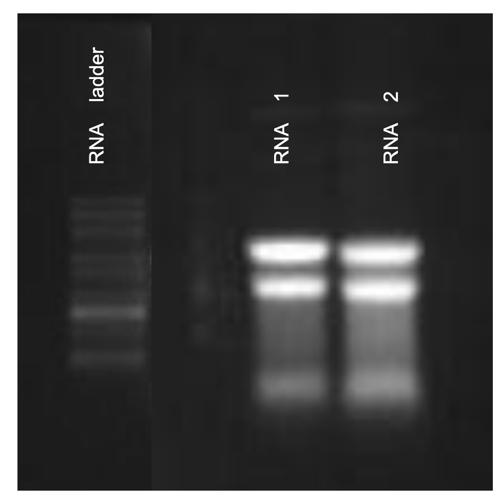
* Then came microarrays:
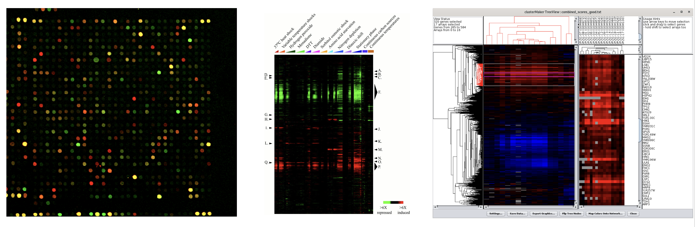

* And now, the network view:
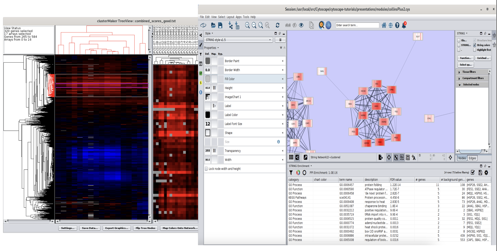

## **Single Cell Transcriptomics**

## **Proteomics**
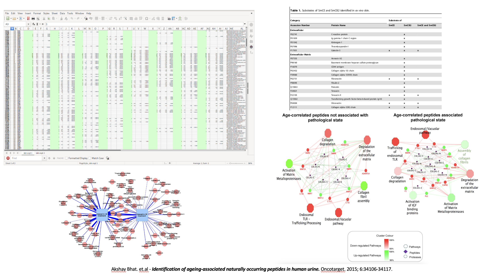

## **Networks are powerful tools...**

* Reduce complexity
* More efficient than tables
* Great for data integration
* Intuitive visualization

## Advantages of Networks as Tool
**Analysis**

* Topological properties
* Hubs and subnetworks
* Classify, cluster and diffuse
* Data integration

**Visualization**

* Data overlays
* Layouts and animation
* Exploratory analysis
* Context and interpretation

## Applications in Research

([Click Here for more network examples:](https://www.ncbi.nlm.nih.gov/pmc/?term=(cytoscape+AND+network)+AND+(%222022/01/01%22[PUBDATE]+%3A+%223000/01/01%22[PUBDATE])&report=imagesdocsum&dispmax=100))

# Biological Network Taxonomy

## Pathways

* Metabolic
* Signaling
* Regulatory
* Disease

## Interactions

## Similarity
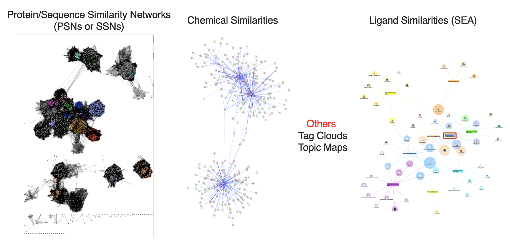

# Public Repositories
## Pathway data

* WikiPathways
* Reactome
* KEGG
* Pathway Commons (collection)
* Published Pathway Figures

## Network data

* STRING
* IntAct
* NDEx (collection)

## Sources of PPI Data

* Experimental Techniques
**High Throughput**
**Low Throughput**
* Computational Techniques
* Public Repositories

**Know what to look for. Know what you're getting.**

## Finding Network Data
**Where do I find the network?**

* There is no such thing!

* There are hundreds of different interaction databases

* It depends on your biological question and your analysis plan,

**But know what you are getting.....**

## Starting with a gene list......
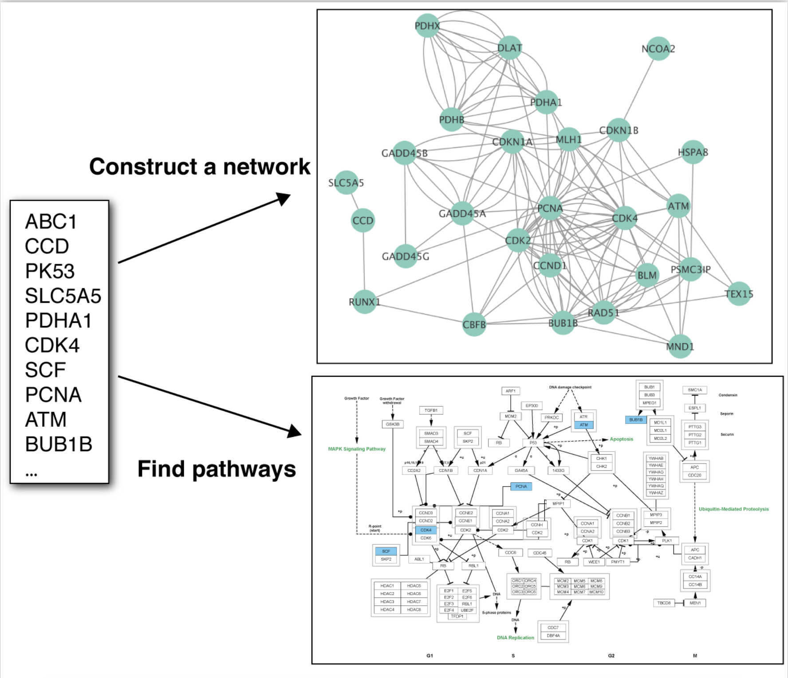

# Networks

## Broad coverage / Lower resolution

* STRING (**stringApp**)
* NDEx (**built-in**)
* PSICQUIC (**built-in**)
* IntAct (**IntAct App**)

# String
## StringApp
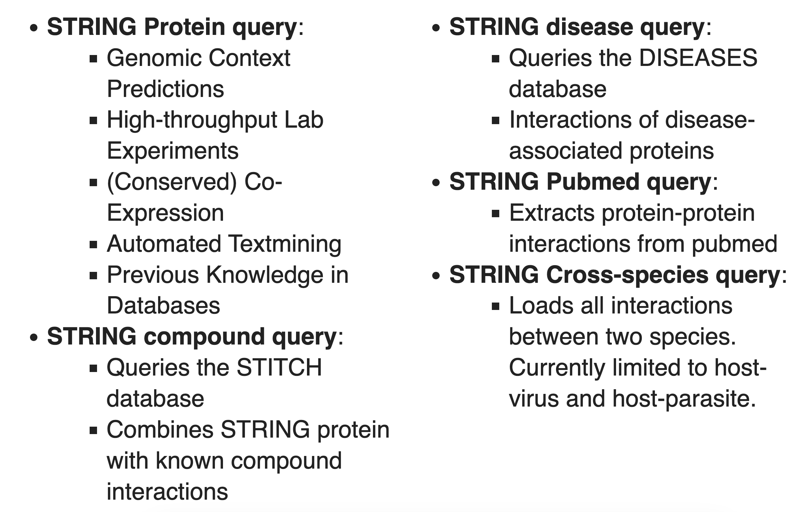

## Use the Network Search Tool to select a resource:

## STRING Settings

## STRING Results

## STRING Options
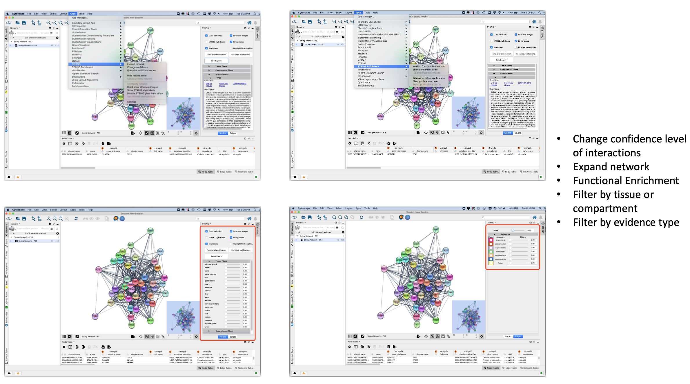

## STRING Enrichment

# NDEx

## CyNDEx App

* Repository for biological network knowledge
* Organisations and individual scientists can deposit
* Use CyNDEx App to import/export networks
* Featured collections include:
  * Pathway Interaction Database (NCI-PID)
  * Cancer Cell Maps Initiative (CCMI)
  * The NDEx Butler
  * NetPath

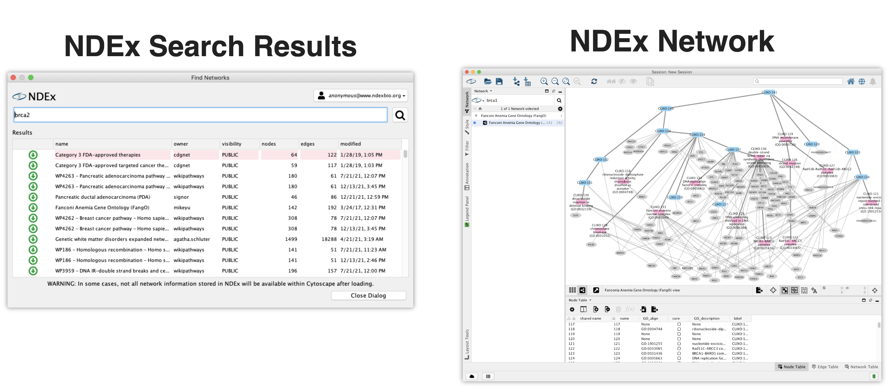

# PSICQUIC

## PSI common query interface

**PSICQUIC is included in the Cytoscape network search tool:**

# IntAct

## IntAct App

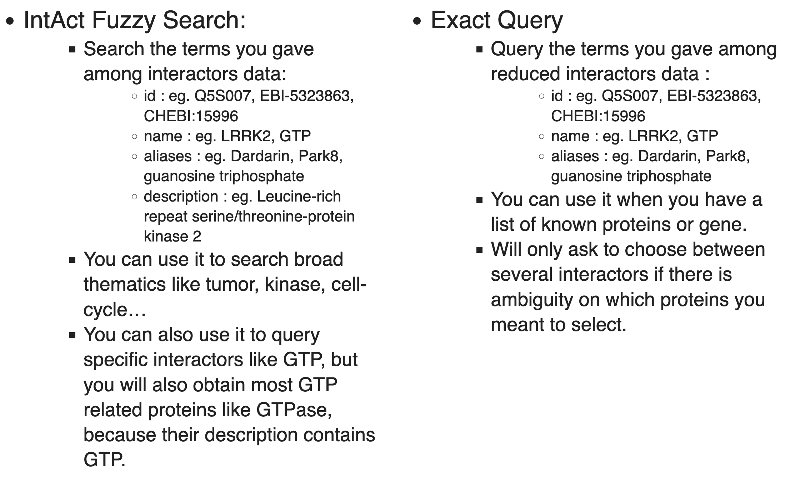

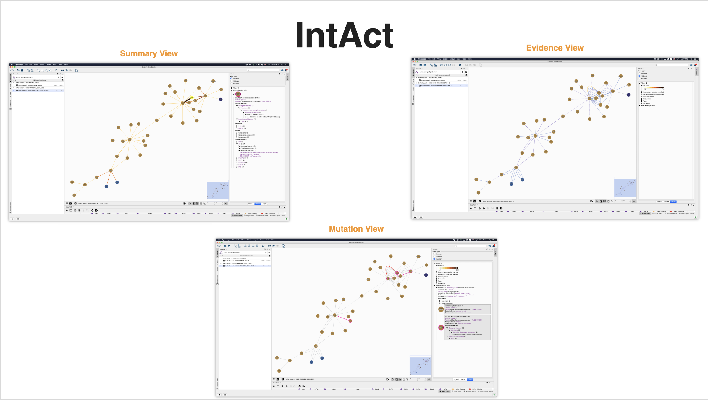

# IntAct - Filters

* Can filter network by:
  * MI Score
  * Interaction detection method
  * Participant detection method
  * Host organism
  * Expansion (e.g. spoke vs. matrix)
  * Type (interaction type)
  * Mutations (hides unmutated edges)

# Pathways

## Higher resolution / Limited coverage (~50% of genes)

* WikiPathways (**WikiPathways App**)
* Reactome (**ReactomeFI App**)
* Pathway Commons (**CyPath2 App**)
* KEGG (**KEGGscape App**)

# WikiPathways
## **WikiPathways App**

* Handmade pathway models
* Collaborative platform open to all researchers
* Thousands of pathways for dozens of species

Use the **Network Search Tool** to select a resource:
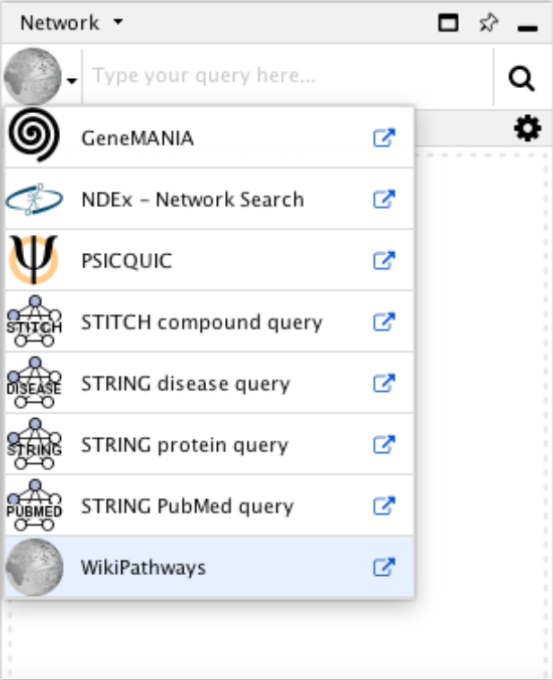

## WikiPathways Search

## WikiPathways Results
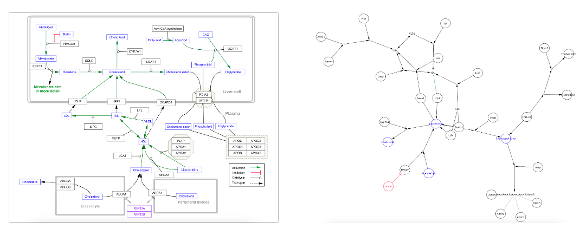

## Pathway Database Apps
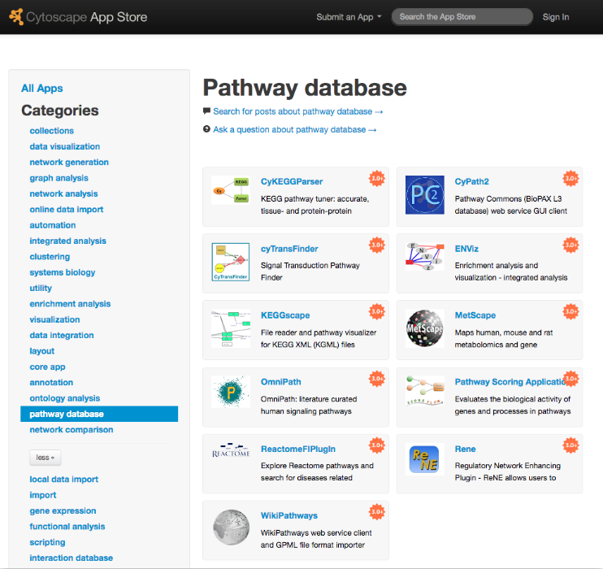

# Cytoscape

## Core Concepts

## Cytoscape Apps!
**apps.cytoscape.org**

# Loading Network Data

## Cytoscape can import network data from:

* Files (or URLs)
  * Excel, TSV, CSV
  * XGMML: eXtensible Graph Markup and Modelling Language
  * SBML: Systems Biology Markup Language
  * BioPAX
  * PSI-MI
  * SIF: Simple Interaction Format
  * GML: Graph Markup Language
  * ... and others depending on loaded Apps

## Cytoscape can import network data from:

* Public repositories:
  * PSICQUIC
  * STRING (via the stringApp)
  * IntAct (via the IntActApp)
  * Reactome (via the ReactomeFI app)
  * WikiPathways (via the WikiPathways app)
  * Pathway Commons (via the CyPath2 app)
  * NDEx
* Automation:
  * Command line scripts
  * CyREST via R, Python, etc
  
## Cytoscape can load tables from:

* Files (or URLs)
  * Excel, TSV, CSV
* Public repositories
  * BioMart
* Automation:
  * Command line scripts
  * CyREST via R, Python, etc

# Saving and Exporting

* Sessions save everything as **.cys** files: Networks, Tables, Styles, Screen sizes, etc.
* Export networks in different formats: SIF, GML, XGMML, BioPAX, JSON
* Export tables as CSV files
* Publication quality graphics in several formats: PDF, SVG, PNG, and JPEG

# Tour of Cytoscape - Exercise 

* Launch the latest version of **Cytoscape**
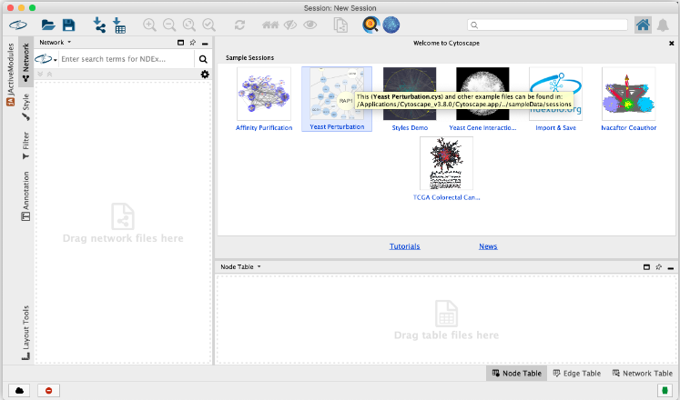

    

# Part B:

## Author: **Dr. Akshay Bhat**
## Last modified: 8th April 2024

# RNA-Seq Data Network Analysis
Cytoscape is an open source software platform for integrating, visualizing, and analysing measurement data in the context of networks.  

This protocol describes a network analysis workflow in Cytoscape for differentially expressed genes from an RNA-Seq experiment. Overall workflow:  

•	Finding a set of differentially expressed genes.   
•	Retrieving relevant networks from public databases.   
•	Integration and visualization of experimental data.   
•	Network functional enrichment analysis.   
•	Exporting network visualizations.   

# Setup

Install the ([stringApp](http://apps.cytoscape.org/apps/stringapp)) from the Cytoscape App Store, or via **Apps → App Store → Show App Store.**   

## OR   

Just visit the **Cytoscape App store** and install/download it from there.
    

    

# Experimental Data
For this exercise, we will use a dataset comparing transcriptomic differences between bladder cancer and normal tissue. The study has been published by Radvanyi F et al., and we will get a summarized dataset with fold change and p-value from the **EBI Gene Expression Atlas**. Array-express ID is **E-MTAB-1940**.
  
  

•	Download the data: Transcriptomic analysis of bladder cancer reveals convergent molecular pathology. ([Here..!](https://raw.githubusercontent.com/a1aks/Cytoscape_Course/main/Data_Files/BCLA-all.tsv)).  First Select all the contents (by holding control + A or Command + A (Mac-users)) and Save the file by right-clicking the mouse button and using save-as option.    
•	To open the tsv data file in Excel, first launch Excel and open a blank workbook. Next, go to **Data → Get External Data → Import Text File....**   
•	In the import wizard, select **Delimited** and in the next step select Tab.
  
•	In the third step, you can select the **Data Format** for every column. The file has 4 columns of data: **Gene ID, Gene Name, fold change and p-value**. **Make sure to change the format for the second column, Gene Name, to Text.** You will have to scroll to the right to see the second column.
  
•	Click **Finish** to complete the import.

    

## Experimental Data
We are going to define a set of up-regulated genes from the full dataset by filtering for fold change and p-value.
    
•	Select the row containing data value headers (row 4) and select **Data → Filter.**  
•	In the drop-down for the fold change column, set a filter for fold change greater than 2. This should result in **263** genes.  
•	Next, one would normally filter out non-significant changes by filtering on the p-value as well, for example setting p-value less than 0.05. But in this case, all genes with a fold change greater than 2 already meet that cutoff.  
•	With the filter active, select and copy all entries in the **Gene Name** column.  
    

    

# Retrieve Networks from STRING

To identify a relevant network, we will use the **STRING** database to find a network relevant to the list of up-regulated genes.
    
•	Launch Cytoscape. In the **Network Search** bar at the top of the **Network Panel**, select **STRING protein query** from the drop-down, and paste in the list of 263 up-regulated genes.  
•	Open the options panel  and confirm you are searching **Homo sapiens** with a **Confidence cutoff of 0.40** and **0 Maximum additional interactors.**  
•	Click the **search icon** to search. If any of the search terms are ambiguous, a **Resolve Ambiguous Terms** dialog will appear. Click **Import** to continue with the import using the default choices. The resulting network will load automatically, and should have around **173** nodes.   

  

    

# STRING Network Up-Regulated Genes

The resulting network contains up-regulated genes recognized by STRING, and interactions between them with a confidence score of 0.4 or greater.
    

    

The networks consist of one large connected component, several smaller networks, and some unconnected nodes. We will use only the largest connected component for the rest of the tutorial.  

•	To select the largest connected component, select **Select → Nodes → Largest subnetwork.**  
•	Select **File → New Network → From Selected Nodes, All Edges.**  
    

    

# Data Integration

Next we will import the RNA-Seq data and use them to create a visualization.  

•	Load the downloaded **E-MTAB-1940-query-results.tsv** file under File menu by selecting **Import → Table from File.....** Alternatively, drag and drop the data file directly onto the Node Table.  
•	In **Advanced Options**..., in the **Ignore Lines Starting With field**, enter #, to exclude the additional lines at the beginning of the data file.  
•	Select the **query term** column as the **Key column for Network** and select the **Gene Name** column as the key column by clicking on the header and selecting the key symbol.  
•	Click **OK** to import. Two new columns of data will be added to the **Node Table.**  

    

    

# Visualization
Next, we will create a visualization of the imported data on the network. For more detailed information on data visualization, see the Visualizing Data tutorial.  

•	In the **Style** tab of the **Control Panel**, switch the style from **STRING** style to **default** in the drop-down at the top.  
•	Change the default node **Shape** to **ellipse** and **check Lock node width and height.**  
•	Set the default node **Size** to **50.**  
•	Set the default node **Fill Color** to **light gray**.  
•	Set the default **Border Width** to 2, and make the default **Border Paint** dark gray.  
    

     
•	For node **Fill Color**, create a continuous mapping for 'NMIBC' vs 'normal' .foldChange.  
•	Double-click the color mapping to open the **Continuous Mapping Editor** and click the **Current Palette**. Select the ColorBrewer **yellow-orange-red shades gradient**.  
•	Finally, for node **Label**, set a passthrough mapping for display name.  
•	Save your new visualization under **Copy Style...** in the **Options** menu of the **Style** interface, and name it de genes up.  
    

    

Apply the **Prefuse Force Directed** layout by clicking the **Apply Preferred Layout** button in the toolbar. The network will now look something like this:
    

    

# Exercise
## STRING Enrichment
The STRING app has built-in enrichment analysis functionality, which includes enrichment for Gene Ontology, InterPro, KEGG Pathways, and PFAM.  

•	Using the STRING tab of the Results Panel, click the **Functional Enrichment button**. Keep the default settings. What do you see.  

    
•	When the enrichment analysis is complete, a new tab titled **STRING** **Enrichment** will open in the **Table Panel**.  
    

    
The STRING app includes several options for filtering and displaying the enrichment results. The features are all available at the top of the **STRING Enrichment tab**. Filter the table to only show **GO Biological Process.**  

## Answer
•	At the top left of the STRING enrichment tab, click the filter icon `r icons::fontawesome("filter", style = "solid")` . Select **GO Biological Process** and check the **Remove redundant terms check-box**. Then click **OK.**  
•	Next, add a split donut chart to the nodes representing the top terms by clicking on   
•	Explore custom settings via   in the top right of the STRING enrichment tab.  
    

    

## Exporting Networks
Cytoscape provides a number of ways to save results and visualizations:   

•	As a session: **File → Save Session, File → Save Session As...**   
•	As an image: **File → Export → Network to Image...**   
•	As a graph format file: **File → Export → Network to File.**   
**Formats:**   
**CX JSON / CX2 JSON**   
**Cytoscape.js JSON**   
**GraphML**   

Save in any of the formats and be ready for publishing.

      

