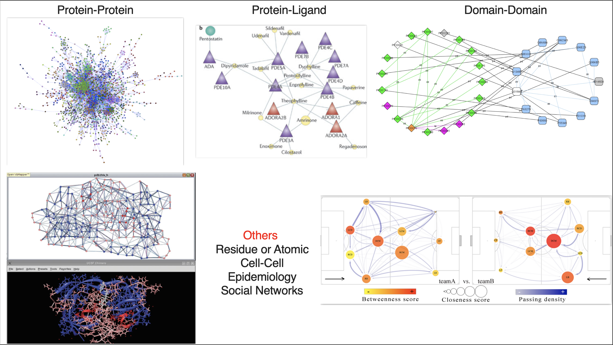

# Part A: Network Analysis with Cytoscape

## Goals and Motivations
By the end of these sessions you should be able to:

* Understand the major applications of network biology
* Find relevant networks and pathways
* Import your data into Cytoscape
* Perform basic topological and other network analyses
* Master network layouts and data visualization
* Know where to find relevant Cytoscape apps and tutorials
* Be able to analyze scRNA-seq data using Cytoscape - Only resource provided. 

## Introduction to Network Biology
## **Why Networks?**
**Networks are everywhere...** especially in biology!

* Molecular networks
* Understand the major applications of network biology
* Find relevant networks and pathways
* Cell-cell communication
* Nervous systems
* Social networks

## **Transcriptomics**
* In the early days:

* Then came microarrays:

* And now, the network view:

## **Single Cell Transcriptomics**

## **Proteomics**

## **Networks are powerful tools...**

* Reduce complexity
* More efficient than tables
* Great for data integration
* Intuitive visualization

## Advantages of Networks as Tool
**Analysis**

* Topological properties
* Hubs and subnetworks
* Classify, cluster and diffuse
* Data integration

**Visualization**

* Data overlays
* Layouts and animation
* Exploratory analysis
* Context and interpretation

## Applications in Research

([Click Here for more network examples:](https://www.ncbi.nlm.nih.gov/pmc/?term=(cytoscape+AND+network)+AND+(%222022/01/01%22[PUBDATE]+%3A+%223000/01/01%22[PUBDATE])&report=imagesdocsum&dispmax=100))

# Biological Network Taxonomy

## Pathways

* Metabolic
* Signaling
* Regulatory
* Disease

## Interactions

## Similarity

We will now go to the next session (1 B) to understand terms about public repositories. 
    

