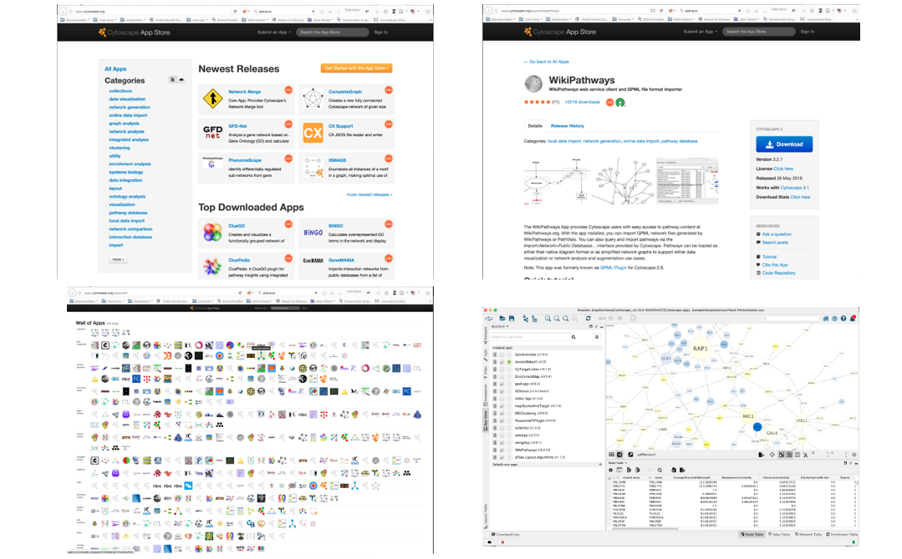

# Part B: Public Repositories

## Pathway data

* WikiPathways
* Reactome
* KEGG
* Pathway Commons (collection)
* Published Pathway Figures

## Network data

* STRING
* IntAct
* NDEx (collection)

## Sources of PPI Data

* Experimental Techniques
**High Throughput**
**Low Throughput**
* Computational Techniques
* Public Repositories

**Know what to look for. Know what you're getting.**

## Finding Network Data
**Where do I find the network?**

* There is no such thing!

* There are hundreds of different interaction databases

* It depends on your biological question and your analysis plan,

**But know what you are getting.....**

## Starting with a gene list......

# Networks

## Broad coverage / Lower resolution

* STRING (**stringApp**)
* NDEx (**built-in**)
* PSICQUIC (**built-in**)
* IntAct (**IntAct App**)

# String
## StringApp

## Use the Network Search Tool to select a resource:

## STRING Settings

## STRING Results

## STRING Options

## STRING Enrichment

# NDEx

## CyNDEx App

* Repository for biological network knowledge
* Organisations and individual scientists can deposit
* Use CyNDEx App to import/export networks
* Featured collections include:
  * Pathway Interaction Database (NCI-PID)
  * Cancer Cell Maps Initiative (CCMI)
  * The NDEx Butler
  * NetPath

# PSICQUIC

## PSI common query interface

**PSICQUIC is included in the Cytoscape network search tool:**

# IntAct

## IntAct App

# IntAct - Filters

* Can filter network by:
  * MI Score
  * Interaction detection method
  * Participant detection method
  * Host organism
  * Expansion (e.g. spoke vs. matrix)
  * Type (interaction type)
  * Mutations (hides unmutated edges)

# Pathways

## Higher resolution / Limited coverage (~50% of genes)

* WikiPathways (**WikiPathways App**)
* Reactome (**ReactomeFI App**)
* Pathway Commons (**CyPath2 App**)
* KEGG (**KEGGscape App**)

# WikiPathways
## **WikiPathways App**

* Handmade pathway models
* Collaborative platform open to all researchers
* Thousands of pathways for dozens of species

Use the **Network Search Tool** to select a resource:

## WikiPathways Search

## WikiPathways Results

## Pathway Database Apps

# Cytoscape

## Core Concepts

## Cytoscape Apps!
**apps.cytoscape.org**

    

# Important Information

## Loading Network Data

## Cytoscape can import network data from:

* Files (or URLs)
  * Excel, TSV, CSV
  * XGMML: eXtensible Graph Markup and Modelling Language
  * SBML: Systems Biology Markup Language
  * BioPAX
  * PSI-MI
  * SIF: Simple Interaction Format
  * GML: Graph Markup Language
  * ... and others depending on loaded Apps

## Cytoscape can import network data from:

* Public repositories:
  * PSICQUIC
  * STRING (via the stringApp)
  * IntAct (via the IntActApp)
  * Reactome (via the ReactomeFI app)
  * WikiPathways (via the WikiPathways app)
  * Pathway Commons (via the CyPath2 app)
  * NDEx
* Automation:
  * Command line scripts
  * CyREST via R, Python, etc
  
## Cytoscape can load tables from:

* Files (or URLs)
  * Excel, TSV, CSV
* Public repositories
  * BioMart
* Automation:
  * Command line scripts
  * CyREST via R, Python, etc

## Saving and Exporting

* Sessions save everything as **.cys** files: Networks, Tables, Styles, Screen sizes, etc.
* Export networks in different formats: SIF, GML, XGMML, BioPAX, JSON
* Export tables as CSV files
* Publication quality graphics in several formats: PDF, SVG, PNG, and JPEG
  

## Tour of Cytoscape - Exercise 

* Launch the latest version of **Cytoscape**

  

* Save your cytoscape app as a session in **.cys ** format for future use. 

