```{r setup, include=FALSE} 
knitr::opts_chunk$set(warning = FALSE, message = FALSE) 
``` 


# Introduction

In Session 1, we read in bulk-rna seq data that was obtained from our previously published study on bladder cancer muscle invasiveness into cytoscape and got familiar with how **Cytoscape** can be used for analyzing and interpreting next-generation sequencing data sets. Here we will perform functional enrichment analysis to retrieve networks and pathways, integrate and explore biological data, perform functional enrichment analysis and interpret our data to display it in publications.

# Background 
**Cytoscape** is an open source software platform for integrating, visualizing, and analyzing measurement data in the context of networks.

# Learning Objectives

* Retrieve Networks and Pathways

* Integrate and Explore Your Data

* Perform Functional Enrichment Analysis

* Functional Interpretation and Display 

<div class="information">

# Setup


* Install and launch [Cytoscape.](https://cytoscape.org/) If this is your first time launching Cytoscape, refer the [manual](https://manual.cytoscape.org/en/stable/) or tutorial in [Session 1](https://a1aks.github.io/Cytoscape_Course/session1.nb.html) for a basic introduction. <br></br>
* Go to the app store to install the [Functional Enrichment Collection.](https://apps.cytoscape.org/apps/functionalenrichmentcollection)

</div> <br></br> 


# Load TCGA data

## Create the network

* Download [BCLA-all.tsv.]("https://github.com/a1aks/Cytoscape_Course/blob/main/Data_Files/BCLA-all.tsv")
* Import the file to create a network using **File → Import → Network from File..** 
* Alternatively, drag and drop the data file directly onto the **Node Table**.
* This will bring up the **Import Network From Table** dialog.
  * Click on **Select None** to disable all columns.
  * Click only on the **GeneName column** and set this column as the **Source Node column** (green circle).
  * Click **OK.** You’ll see a warning about no edges, but that’s OK. This will create a grid of 1500 unconnected nodes, where each node represents a gene.
  
## Add data to our nodes

  * Open the file again, but now use **File → Import → Table from File...**
  * This will bring up the **Import Columns** From Table dialog.
    * It turns out that all of the defaults are correct for just importing the data, so click on **OK.**
    * This will import all of the data in the spreadsheet and associate each row with the corresponding node.
    * You should be able to see this in the **Table Panel**.
  

## Find significant expression changes

We’ll use the **Filter tab** in the Control Panel to find the significant overall expression changes.


  * Open the **Filter tab** and click on the **+ button** to add a new condition. In this case we’re going to add a Column Filter. Select the **"Mean log2FC"** column and set the values to be between **-3 and -0.5**. This will select all genes that are significantly underexpressed on average, across all samples (**only one gene should be selected**).
  * Repeat the same process as above, but set the values to be between **0.5 and 3**. You’ll also need to change the type of match (at the top of the panel) to **Match any (OR)**. No additional genes will be selected in this case (but this approach will be reused later).


<br></br>

**30 genes** shows significant average expression changes across all samples, some genes in the list has been shown to be linked to bladder cancer, but it’s still a relatively unsatisfying result that only a 30 proteins change expression in bladder cancer patients. A closer examination might be in order...


<br></br>

# Cluster to see expression patterns
Let’s cluster all of the data to see if there are any significant patterns that have been averaged out by looking at all samples in the aggregate. **clusterMaker2** is a Cytoscape app that provides a number of clustering algorithms including **hierarchical and k-means**.

## Perform hierarchical clustering. 

In Cytoscape, **select Apps → clusterMaker Cluster Attribuites → Hierarchical cluster.** This will bring the settings for hierarchical clustering. **Select Pearson correlation** for Distance metric and **Select all of the samples (columns beginning with **TCGA-**)** in the **Node attributes for cluster** list. The checkboxes **Cluster attributes as well as nodes, Ignore nodes/edges with no data**, and **Show TreeView when complete** should all be checked. Then click **OK**. The resulting TreeView should look like the figure below.

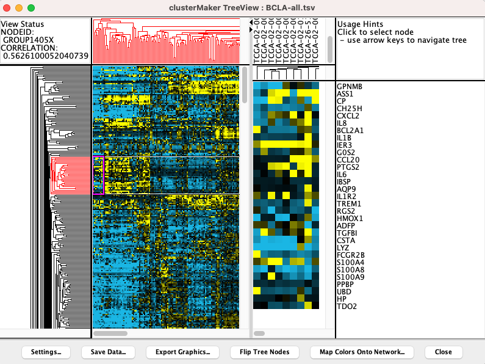


<br></br>

Users can use some of the options below in the panel (like **Flip Tree Node or Mapp Colors onto Network**) to edit the heatmap and/or select stringent statistics to select few sets of genes. 

Looking at the result, is seems like there are definite bands of expression data that look similar across a group of patients, but differ between groups, however, the exact number of clusters and divisions between them aren't completely clear. Based on previously reported results, it has been suggested that there are 4 different subtypes of bladder cancer, however, these subtypes have been updated to 6 or more in recent studies. Let’s take that known data and see if we can subset the data into 4 subtypes as an example.


* **Perform k-means clustering**. In Cytoscape, select **Apps → clusterMaker Cluster Attribuites → K-Means cluster**. In the resulting settings dialog, set the number of cluster to **4**, which is the number of known subtypes of bladder cancer, as with the hierarchical cluster, **select all of the samples (TCGA-)**, check Cluster attributes as well as nodes and Show HeatMap when complete. This will result in a heat map similar to the one in the figure below.

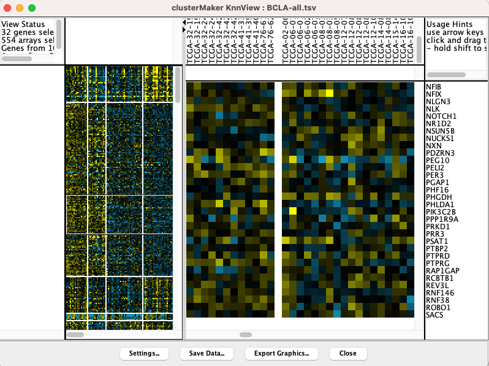
<br></br>

* Note that there are four distinct vertical bands (your results might vary in the ordering in either the vertical or horizontal dimensions). In fact, the firehose analyses identified the same four groupings of patients. In the spreadsheet loaded originally, we’ve calculated the mean Log2(fold change) for each of the four subtypes.


<div class="information">
# Excercise 

* Find significant expression changes in **Cluster 1** <br></br>
**Hint:** We are going to repeat step 4 with "Cluster 1 Mean log2FC" as the column. This represents the mean expression across the samples in cluster 1 (the leftmost cluster in the previous figure).

Open the **Filter** tab and setup two **Column Filters** for the **"Cluster 1 Mean log2FC"** column, one for up and one for down. Select the **"Cluster 1 Mean log2FC"** column and set the values to be between **-5 and-1**, then add a second filter (be sure to specify **OR **at the top) and set the values between **1 and 5**.
This should result in a selection of 192 nodes.

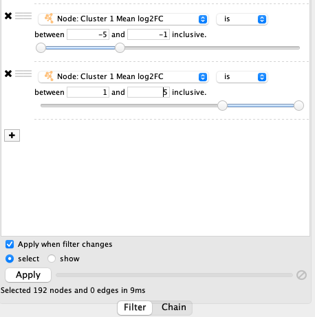
<br></br>
* Download the PPI from STRING
From the above selection filter, we’ve identified 192 nodes that show an average **Log2FC greater than 5 or less than 1**, and selected those nodes. Now, we create a separate network that includes all of those 192 nodes by selecting the **"Create Network from selected nodes and edges option"** and then load the protein-protein interaction data from **STRING.** Note that only the selected nodes are shown in the **Table Panel**.


## **Select gene names from Table Panel.** 
* Select everything in the **name** column by clicking into the first cell and then dragging down until you get to the bottom. Then, do a copy **(Control-C or Apple-C).**

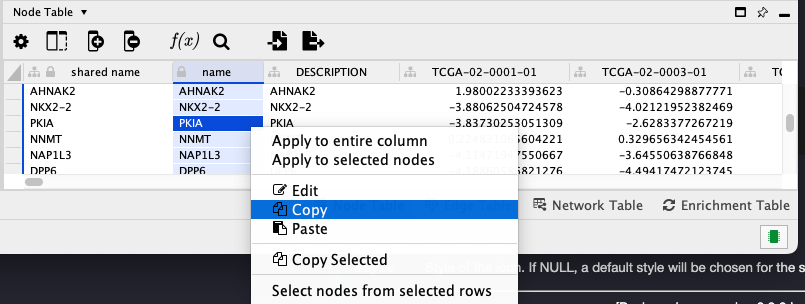 
<br></br>

* **Paste gene names into STRING network search**. In the **Network** tab of the **Control Panel** at the top should be a text field with an icon at the left. Click on that icon and select **STRING protein query**. (If you don’t see any **STRING** options, the **stringApp** hasn’t been loaded and needs to be loaded from either the App store or Cytoscape options menu.) Then click into the text field and paste the list of genes.

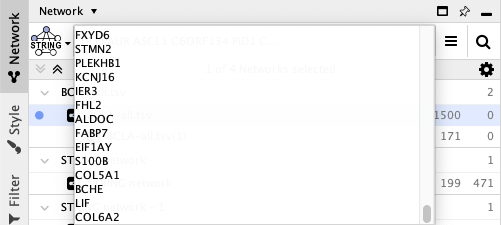
<br></br>

* **Set STRING search parameters.** Next to the text field is a menu with a list of options. Change the **Confidence (score) cutoff** to 0.8 and the **Maximum additional interactors** to 30. This will get only high quality results (80% confidence) and add 30 extra proteins to the network.
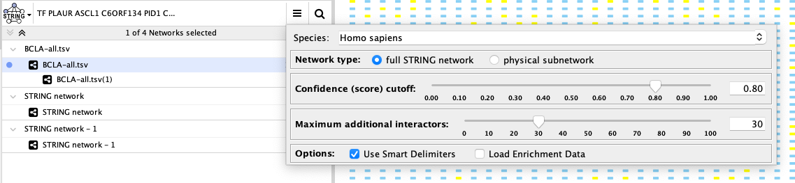
<br></br>

## **Create the network.** 
Click on the search icon (magnifying glass) to load the network. The network should appear similar to the figure below.

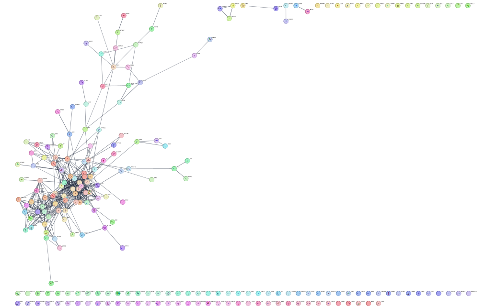 
<br></br><br></br>
* Style the network to show differential expression.
In this step, we’ll change the style of the network to highlight the differentially expressed genes.

</div> <br></br>

## **Re-import expression data**.
First, we need to re-import the expression data for the new network created by the **stringApp.** Similar to the initial import, start by doing **File → Import → Table from File.** Again, select the BCLA-all.tsv file. However, now we need to use a different network column to match our names. Change the **Key Column for Network:** from **shared name** to **query term**. STRING uses Ensembl identifiers, but retains the original query term so we can match data against. Now select **OK.**

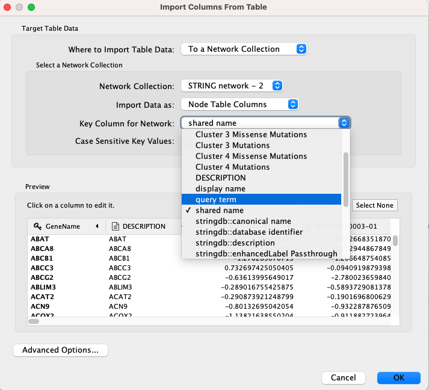 <br></br>

## **Disable structure image.** 
**STRING** provides some nice images of the 3D structure of the proteins, but we need to disable those to be able to see our expression values clearly. Disable the images by going to **Apps → STRING → ** untick **show structure images.**

## **Create color gradient for expression data.** 
To show the expression data, go the **Style** tab of the **Control Panel** and click on the middle square **(Map.)** of the **three Fill Color controls.** Set the Column to "Cluster 1 Mean log2FC" and set the **Mapping Type** to **"Continuous Mapping"**. Double-click on the gradient to show the **Continuous Mapping Editor**. The default gradient is a Blue/Red color gradient, with blue representing underexpressed genes and red representing overexpressed genes. We can keep this default gradient as is.

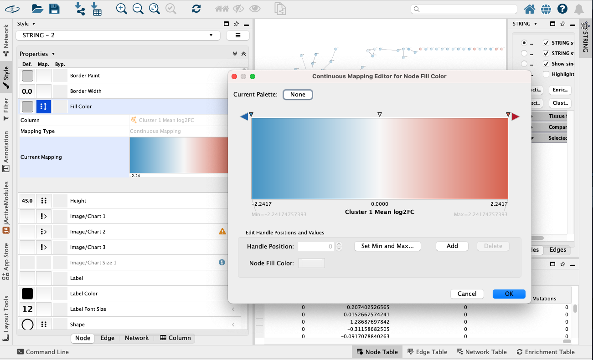 <br></br><br></br>
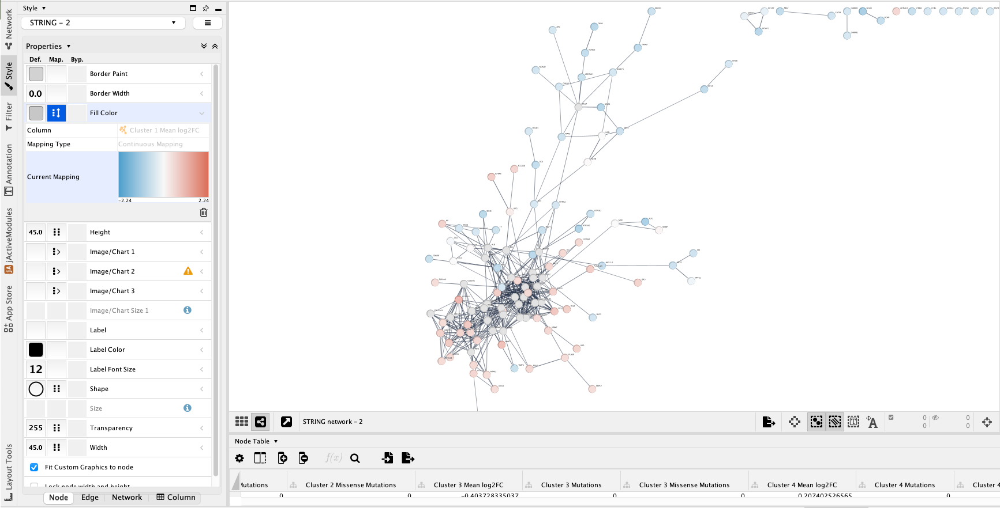 <br></br>

 <br></br>


# Add styling to show mutations

In addition to expression fold change, the imported data also includes information about mutation, both across all patients and subdivided by cluster. It might be informative to add that information to our visualization.

## **Lock node width and height.** 
By default, the **stringApp** provides separate values for Node Width and Node Height. In our case, we just want to lock them to be the same so we only have to modify the Node Size. The **Lock node width and height** is a checkbox at the bottom of the **Node** tab in the **Style** tab of the **Control Panel**. Make sure that it’s checked.

## **Set the default node size.** 
Click on the leftmost (Def.) box next to **Size**. Set the default size to "45.0".
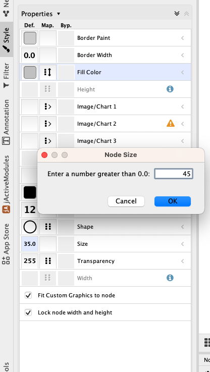 
<br></br>
<br></br>


## **Map mutation to node size.** 
Click on the middle (Map.) box next to **Size**. Choose "Cluster 1 Mutations" for the Column and "Continuous Mapping" for the **Mapping Type**. Then double-click on the ramp that appears to bring up the **Continuous Mapping Editor**. Click on the leftmost triangle and set the **Node Size** to "45". Then click on the right-most triangle and set the **Node Size** to "90". Then check **OK**.

<br></br>
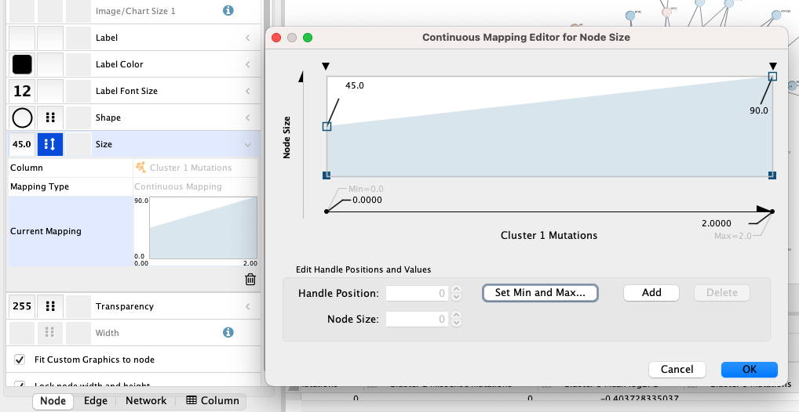 
<br></br>
<br></br>


# **Examine the network.** 
Examining the main connected component of the network, we immediately see that there is a group of overexpressed genes, **COL6A3, COL1A1, COL1A2, etc.**, that also exhibit some mutations. There is also a group of genes, **MMP7, MMP9, TIMP4 and MMP2** that show some mixed expression changes. Finally, there is a group of genes, including **NCAN, BCAN SDC3, and GABBR1**, in between these groups that show predominantly underexpression.
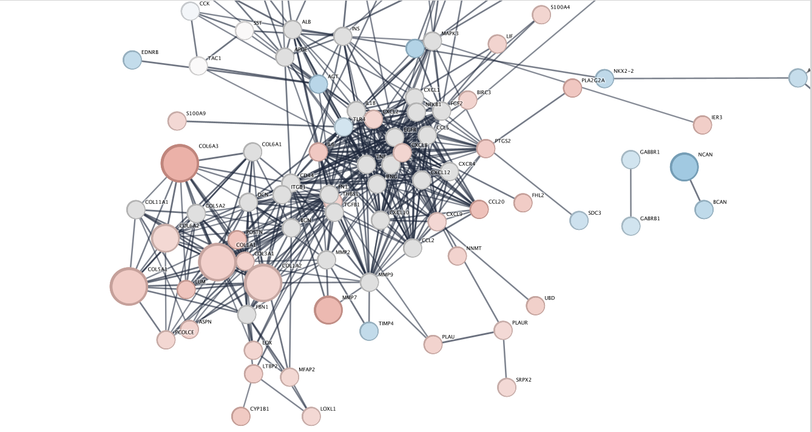 

<br></br>
<br></br>

## At this point in our workflow, we have some options:

One typical path might be to find all of the overexpressing genes, use the Diffusion app to perform heat diffusion through the network to grow the selection and then perform functional enrichment analysis on that set of genes and then repeat for underexpressing genes (see step **Smooth the network using Diffusion** below).

Another approach is suggested by the topology of the network, which strongly suggests groupings in the interactions. We can use clustering based on the network topology and to perform functional enrichment on each cluster (see step **Topologically cluster the network**). We’ll take each of those in turns.

# Smooth the network using Diffusion.
When we created the **STRING** network, we added nodes to make sure that well connected nodes that might be silent (i.e. not exhibit changes in expression) could be included. Well connected genes might play a significant role in the biology even if their expression doesn’t change due to changes in the expression of their interaction partners. The Diffusion app supports the ability to find those genes by simulating the diffusion of heat through network connections.

## Create subnetwork of the main connected component. 
Select all of the nodes and edges in the main connected component by holding mouse button 1 down and sweeping over the nodes. Alternatively, you could select a single node and then repeatedly hitting **Control-6 (or ⌘6 on the Mac)** to continually select the first neighbors of selected nodes until all of the nodes in the connected component are selected. Once the entire component is selected, create a new network by doing **File → New Network → From Selected Nodes, All Edges.**

## Select overexpressed genes. 
Go back to the **Filter tab ** and disable (click on the X) the filter for underexpressed genes, then click **Apply**.

## Diffuse the selection. 
In the diffusion app we can diffuse either based on the heat (column value) or just based on the selection. We’re going to diffuse based on our expression values, so **select Tools → Diffuse → Selected Nodes with Options** and in the dialog select **"Cluster 1 Mean log2FC"** as the **Heat Column** and set a short time of **0.001 seconds**. Then click **OK.**

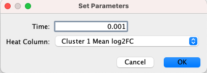 

<br></br>

## Create subnetwork. 
* Change the **Node Rank** to about 40 and create a subnetwork by **selecting File → New Network → From Selected Nodes, All Edges.** 

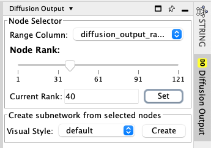 
<br></br><br></br><br></br>
* Once the network is created, execute an unweighted Prefuse Force Directed Layout **(Layout → Prefuse Force Directed Layout → All Nodes (none))**.
<br></br><br></br>
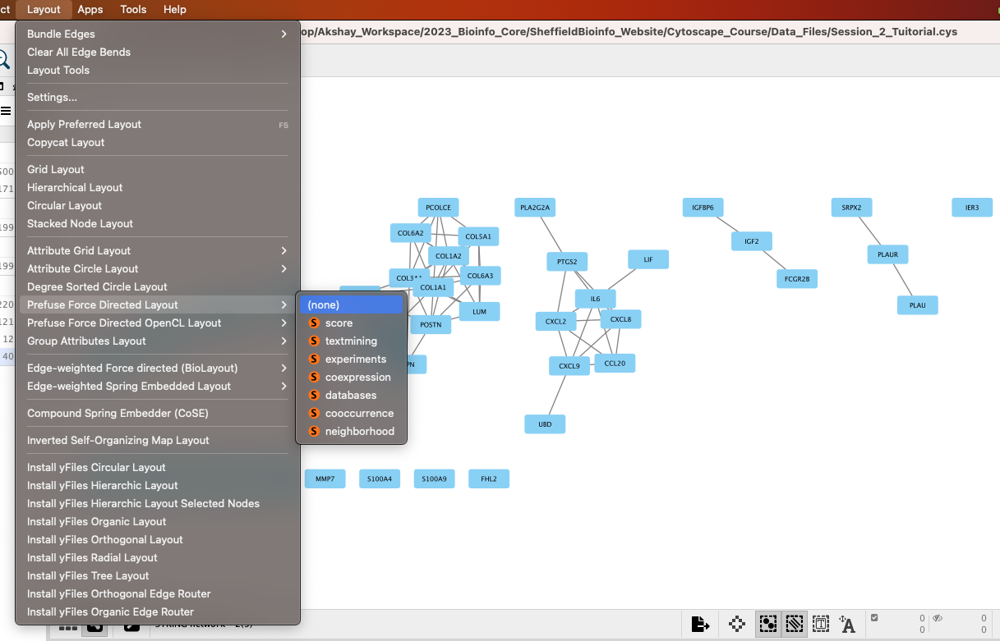 

<br></br>

* **Repeat for underexpressed genes.** For underexpressed genes, repeat the previous steps above, except choose all genes with a **"Cluster 1 Mean log2FC"** less than **-1** and in the diffusion app set the time to 0.01 seconds. Unfortunately the Diffusion Output assumes positive diffusion values, so to select the diffused nodes of interest, you’ll need to go to the Table Panel and sort the diffusion_output_heat column, select the negative values less than **-0.5**, right-click on the column and select Select nodes from selected rows. Then you can create the subnetwork.
<br></br><br></br>


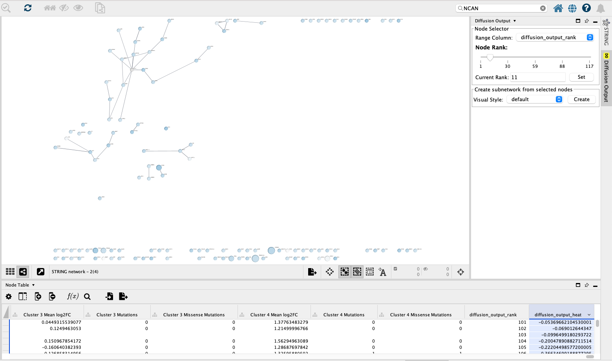 

<br></br><br></br>

## Perform enrichment analysis on the diffused subnetworks. 

There are many tools available in **Cytoscape** to perform functional enrichment. For simplicity we’re going to use the built-in **functional enrichment** available from the stringApp. The description below walks through calculating function enrichment of the overexpressed subnetwork, but the same approach will work for the underexpressed network.

* **Set network as a STRING network.** In order to retrieve the function enrichment scores the stringApp needs to be told that this is a STRING network. A menu item is available for that purpose: **Apps → STRING → Set as STRING network.**


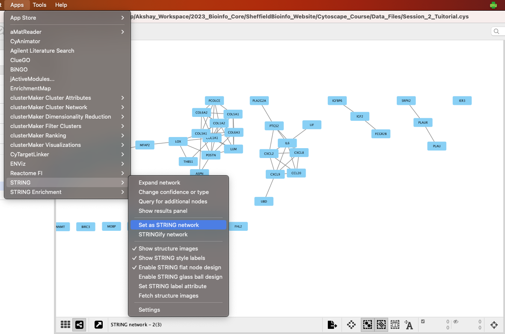 
<br></br><br></br>
* **Retrieve functional enrichment of a component.** In the subnetwork, there are two connected components of any size. Select all of the nodes in the largest one and retrieve the functional enrichment through the **Apps → STRING → Retrieve functional enrichment.** This will bring up a new Table Panel tab for **“STRING Enrichment”**.

* There is a filter icon which bring up a menu to switch the ontology or pathway displayed. In the case of the largest component, we see that there is a significant overexpression of genes involved in the **GO Biological Processes:** extracellular matrix organization, collagen catabolic process, and other development processes; they are also associated with the KEGG pathways Protein digestion and absorption and ECM-receptor interaction.


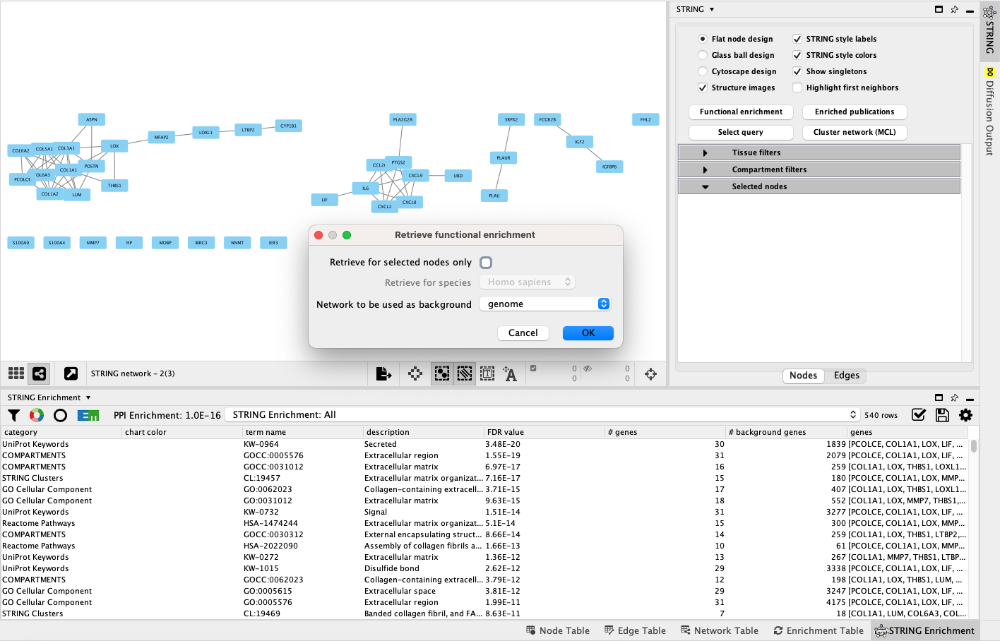 

<br></br><br></br>


<div class="exercise">
## Exercise:
* **Repeat for underexpressed network.**
</div>


# Topologically cluster the network. 

Looking at the protein-protein interaction network (left), we see that there appear to be strong connections between groups of nodes (see discussion in 9 above). One approach to explore the functional interactions of the network is to use a topological clustering algorithm to partition the network based on the interactions. The clusterMaker2 app provides a set of topological (network) cluster algorithms. One commonly used one is MCL, which performs a Markov-based flow simulation to determine clusters.

<br>
</br><br>
</br><br>
</br><br>
</br><br>
</br><br>
</br><br>
</br><br>
</br><br>
</br><br>
</br><br>
</br><br>
</br><br>
</br><br>
</br>


<br>
</br>
<br>
</br>
<br>
</br>
<br>
</br>


## ####################### END OF COURSE #######################################
