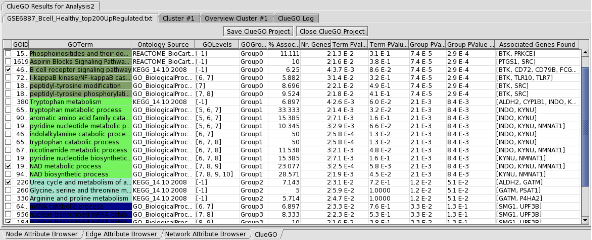

```{r setup, include=FALSE}
knitr::opts_chunk$set(
  tidy = TRUE,
  tidy.opts = list(width.cutoff = 95),
  message = FALSE,
  warning = FALSE,
  fig.width = 10,
  time_it = TRUE
)

```

# Introduction

In this session we will learn how to perform pathway enrichment analysis using gene sets from our transcriptomics experiment by using two **Cytoscape plugins - ClueGO and CluePedia**. ClueGO and CluePedia are some of the most highly rated or top downloaded apps in the ([Cytoscape App Store]("https://apps.cytoscape.org/")). 


## Installation

* Go to https://apps.cytoscape.org/apps/cluego and click **Download** or **Install** (if your cytoscape application is open)
* More on installation, documentation and how to integrate the package with R or Python is described ([here:](http://www.ici.upmc.fr/cluego/cluegoDocumentation.shtml))
* Also go to https://apps.cytoscape.org/apps/cluepedia and click **Download** or **Install** (if your cytoscape application is open) - We will be using in this app in the second session of this course. 

**NOTE: You can also download/install plugins directly from the Cytoscape-App Store.**


## System Requirements: 
* Windows, Linux, Unix or MacOS operating system.
* 16 GB RAM recommended. Hard disk with at least 100 MB free (for example files).
* Java 1.8+ needed - **VERY ESSENTIAL**. This can be installed from the Download's page in the Cytoscape website. 
* **Cytoscape 3.7.+** installed: https://cytoscape.org/ - latest is **version 3.10.2**.


## Note 
This course is intended for an audience who wish to analyse biological data (with an example of RNA-Seq) and have no previous or only basic programming experience. However, for those who are keen and want to integrate Cytoscape (and its packages like ClueGO and CluePedia) using R or Python, then please refer to http://www.ici.upmc.fr/cluego/cluegoDocumentation.shtml to obtain the required API. 


## Basic Terms and Network Biology Background

Generally, the biological interpretation of large gene clusters derived from high-throughput experiments is a real challenge. 
Many ontology sources exist in order to capture biological information in a meaningful way.

* **The Gene Ontology (GO) projects** [1] aims to capture the increasing knowledge on gene function in a controlled vocabulary applicable to all the organisms. **GO** describes gene products in terms of their associated biological processes, cellular components and molecular functions.

Between the terms there is a hierarchical relationship (parent-child). Due to the complexity of hierarchy structure (directed acyclic graph), the terms can be in several different levels. The specificity of the terms varies along the tree: from very general terms (in first levels of GO) to very specific ones.

* **Kyoto Encyclopedia of Genes and Genomes (KEGG)** [2] is a database of biological systems that integrates genomic, chemical and systemic functional information.

* **BioCarta** - [BioCarta](https://maayanlab.cloud/Harmonizome/dataset/Biocarta+Pathways) provides useful pathway information.

* **Reactome** - [Reactome](https://reactome.org/) is a free, open-source, curated and peer-reviewed pathway database.   

* **WikiPathways** - [WikiPathways](https://www.wikipathways.org/) is an open, collaborative platform dedicated to the curation of biological pathways. WikiPathways thus presents a new model for pathway databases that enhances and complements ongoing efforts, such as KEGG, Reactome and Pathway Commons. 


For a complete view on the studied process, several ontology sources should be consulted in order to integrate their complementary information. In each source, for each gene, there is a large amount of information. This makes the analysis of the relationship between genes and between terms very difficult to represent and comprehend. Also, for close related terms, a high degree of redundancy of their associated genes exists.

## **ClueGO**
An open-source Java tool that extracts the non-redundant biological information for large clusters of genes, using GO, KEGG, Reactome, WikiPathways and BioCarta. 

* **ClueGO** is integrated in **Cytoscape** (https://cytoscape.org/) as a plug-in and it is taking advantage of its complex visualization environment.
<br></br>


### **ClueGO** features include:

* ClueGO allows analysis of a single gene set (cluster) or cluster comparison.
* Different filter criteria can be applied to the terms.
* Fusion of the related terms that have similar associated genes.
* Functional grouping of the terms based on GO hierarchy or based on kappa score.
* Visualize the selected terms in a functionally grouped network.
* Charts presenting the specific terms and groups for the clusters compared.
* Statistical significance for the terms and for the groups.
* ClueGO can be used in combination with GOlorize (another **Cytoscape** tool for pathway enrichment) [here](https://apps.cytoscape.org/apps/golorize).
* Easy updatable.
* Easy extendable.


## Selection Panel

After starting Cytoscape, **ClueGO** can be found under the Plugins menu. Once selected, it will display the ClueGO selection panel options. See Figure below:

1. Select the type of analysis. Besides analysis of a single gene set (cluster), ClueGO performs comparison of clusters, underlying the specificity and also the common aspects of their functionality.


2. Select organism. **For the moment, ClueGO supports Arabidopsis thaliana, Bos taurus, Caenorhabditis elegans, Danio rerio, Dictyostelium discoideum, Drosophila melanogaster, Escherichia coli, Galus galus, Homo sapiens, Magnaporthe grisea, Mus musculus, Oryza sativa, Rattus norvegicus and Saccharomyces cerevisiae.** 
3. Select identifiers type (AffymetrixID, AccessionID, SymbolID).
4. The identifiers can be uploaded from text files or interactively from a Cytoscape sub-network.
ClueGO provides sample files containing specific genes (AccessionID) for Human B and NK cells.
A Saccaromyces network sample (galFiltered.cys) can be found in the Cytoscape sampleData
folder. In today's course we will use bladder cancer data from the **Data-File located in our tutorial folder**. [Here..](https://github.com/a1aks/Cytoscape_Course/tree/main/Data_Files)
5. Choose the any file with identifier 
* "Top_Down_genes_BLCA_Session3.txt"
* "Top_Up_genes_BLCA_Session3.txt"
6. Select the ontology/ontologies. To make ClueGO faster, we use precompiled files based on GO,
KEGG and BioCarta. The precompiled files are included in the ClueGOPlugin.jar.
7. Select the evidence code, option available for the GO based files. For more details, see
http://www.geneontology.org/GO.evidence.shtml.
8. Update the ontology (see ClueGO updates)
9. The significance of each term or group can be calculated with hypergeometric test (enrichment,
depletion). Standard is hypergeometric test two sided.
10. Several methods for PValue correction are proposed: Bonferroni, Bonferroni step-down and BenjaminiHochberg.
11. Advanced statistical options
12. Select network type. We predefined selection criteria leading to a ”Global” network, a ”Medium”
network or a ”Detailed” network.
The ”Global” network displays GO terms found in the GO levels 1-3, with a high number of
genes associated and a small percentage of uploaded genes found. Those terms provide a general
biological information. At the opposite, the ”Detailed” network shows very specific terms placed
in GO levels 9-14, with only few associated genes but a high percentage of the uploaded genes
found. Those terms are more specific and informative underlying particular aspects of the studied
gene product.
The predefined settings provided by ClueGO should be combined with a customized selection for
an analysis adapted to the biological question addressed (general/specific investigation) and to the
number of genes involved.
13. Advanced settings.
14. Start the analysis.


## ClueGO result

A functionally grouped annotation network, a ClueGO information table, charts with terms and groups
and the loging information are the result of ClueGO analysis. The created networks and analysis results
can be saved in a specified project folder and used for further analysis. If the analysis is not needed
anymore, it is recommended to close the project.


## Functionally Grouped Annotation Network

ClueGO visualizes the selected terms in a functionally grouped annotation network (See Figure 2) that
reflects the relationships between the terms based on the similarity of their associated genes. The size
of the nodes reflects the statistical significance of the terms. The degree of connectivity between terms
(edges) is calculated using kappa statistics, in a similar way as described in [4]. The calculated kappa
score is also used for defining functional groups. A term can be included in several groups. The reocurrence of the term is shown by adding ” n”. The not grouped terms are shown in white color. Predefined,
the group leading term is the most significant term of the group. The network integrates only the positive
kappa score term associations and is automatically laid out using Organic layout algorithm supported by
Cytoscape.


## Information table

**ClueGO** Information table provides information about the selected terms. From left to right:

1. Group leading term. There are several ways of defining the leading term of the group (see Advanced Settings). Predefined, the leading term has the highest significance in the group.



2. GOID.
3. GO Term.
4. Ontology Source.
5. GO levels. Due to the complex structure of GO tree (directed acyclic graph), the GO terms can be
placed in several levels. In case of using sources without hierarchical structure (KEGG, BioCarta),
the level it is assigned as -1.
6. The group or the groups that include the term.
7. The percentage of the genes from the uploaded cluster that were associated with the term, compared with all the genes associated with the term.
8. The number the genes from the uploaded cluster that were associated with the term.
9. Term significance (PValue).
10. Term significance (corrected PValue).
11. Group significance (PValue).
12. Group significance (corrected PValue).
13. The genes from the uploaded cluster that were associated with the term.

## Histogram with terms

The chart presents the specific terms for the user genes and information related to their associated genes.
The display can be customized (see Advanced settings). Predefined, the bars represent the number of
the genes from the analyzed cluster found associated with the term, and the label displayed on the bars
is the percentage of found genes compared to all the genes associated with the term. Term significance
information is included in the chart (see Statistics).


## Overview Chart with functional groups

The overview chart presents functional groups for the user genes. The name of the group is given by the
group leading term (e.g. the most significant term in the group). The group sections correlate with the
number of the terms included in group. The position of the sections can be changed (right click).

## Loging information

Complete information on the applied selection criteria for each analysis can be visualized in the loging
information panel.


## Advanced Settings

ClueGO advanced settings allows a precise adjustment of the selection criteria.


1. GO tree level. The identifiers can be mapped in the entire ontology tree or in a GO level interval
(between Min and Max levels). If selected the first GO levels (1-3), the terms will be very general.
Those terms have many associated genes, so, there will be a low percentage of found genes from
the user genes. The very specific terms (e.g. level 12) have associated a small number of genes.
In this case, the percentage of found genes it is higher. Anyway, one has to consider the complex
hierarchical GO structure that makes the terms to be in several levels. This feature is availabe
while using a hierarchically structured ontology source (e.g. GO).

2. Minimum number of identifiers from the uploaded cluster found to be associated with a term.

3. Minimum percentage that the mapped identifiers are representing from the total associated genes
with the term


4. Fusion. The terms in parent-child relationship that share similar genes (identical, or with one gene
difference) are assessed and the most representative parent or child term is retained.
Note: This is an optional feature. The fusion strongly reduces the redundancy.
5. Kappa Score shows the relationships between the terms based on their overlapping genes. It is
used for creating the network and can be used for creating the groups. Initially, a term-gene
matrix containing the selected terms and their associated genes is created. Based on this, a termterm similarity matrix is calculated using kappa statistics to determine the association strength
between the terms (kappa score). High score = visualize in the network only the connections
between close related terms, with very similar associated genes (high stringency). Low score =
allows to visualize in the network the connections between less related terms (low stringency).
6. Create functional groups. The terms can be associated in functional groups using the ontology’s
hierarchy or the kappa score.
When displaying the functional groups on the network, one has to consider that the network structure is calculated with kappa score. The kappa score grouping of the terms will correspond with
the network structure that is calculated in the same manner. If the hierarchical grouping is used, it
is possible to be a difference between the networks structure (based on the associated genes) and
the functional groups defined using GO hierarchy.

7. Use fix coloring for the groups
8. Use random coloring for the groups
9. The most representative term in a group is giving the name of the group. It can be considered having:
  a) the highest number of the found genes per term
  b) the highest percentage of found genes per term
  c) the highest percentage of found genes per total number of found genes
  d) the most significant PValue
This selection determines the ClueGO charts display: the number/percentage/significance of the
terms. If the group leading term is the term with the higher number of genes or the most significant term from the group, a label with the percentage of the found genes compared with all the
associated genes with the term is displayed on the bars of the chart. Reversely, if the group leading
term is representing the percentage of genes (compared to all the genes associated with the term
or with all the genes found from the uploaded cluster), on the label will be displayed the number
of the genes found for this term.

10. The hierarchy based grouping consists in analyzing the selected terms through the perspective
of their parent terms. The size of the groups can be defined using the number of common and
different parents, that is depending on the level of the term in GO hierarchy. Since KEGG and
BioCarta don’t have a hierarchical structure, the terms selected from those souces will not be
grouped.

11. For grouping the terms based on the kappa score, it is necessary to set the size of the initial group
(e.g. 3) and the percentage (overlaping terms/group) for group merge (e.g. 50 percent). For more
details see [4]. All the possible initial groups with the terms showing a kappa score equal or
above the predefined threshold (e.g.¡= 0.3) are created. Further, the initial groups are iterratively
compared and merged if they are overlapping in the defined percentage. A term can be part of
several groups. The reocurrence of the term is shown by adding ” n”. If the terms have very
similar associated genes, it is possible that the iterative merging of the created groups to take a
longer time in the attempt of merging all the groups. In this case, it is recommnended to increase
the kappa score level or to increase the percentage for group merge.

## Advanced Statistical Options
1. Select mid-P-value for a less conservative hypergeometric test.
2. Select Doubling for a less conservative two tailed hypergeometric test.


## Cluster Comparison

Once selected the option: **”Compare clusters”**, two file choosers are made available. The selection of the
ontology terms is following the same steps as in the analysis for a single cluster.

The difference refers to the number and the percentage of the genes per term. Those selection criteria can
be flexible: Cluster1 OR Cluster2 options (1) or applied strictly for both clusters: Cluster1 AND Cluster2
options (2). 

It is recommended to have comparable number of identifiers in the analysed clusters. If one
cluster is much larger, the selection criteria should be applied more strictly (e.g. increase the number of
genes per term).


Further, we analyze the terms trough the perspective of their associated genes. It is possible that
genes from both clusters will be associated with a term, but in different proportions. We defined a term
as specific for one of the clusters if the percentage of associated genes from this cluster is higher than
the selected threshold (e.g. 66 percent) (3). As result, charts with specific terms for each cluster are
provided. The common terms are included in a separate chart.

On the network, the different proportion of the genes from the analyzed clusters is represented with
a color gradient from green, for the first cluster genes, to red for the second cluster.
The visualization of the groups on the network can be switched with the one of the uploaded clusters
distribution on the selected terms (see Figure below).


## ClueGO result visualizations


<br></br><br></br>


<div class="exercise">

# Walk-through exercise

For the exercise, we are going to use mRNA bladder cancer data generated from RNA-Seq platform. The data can be retrived from Robertson et al. Cell 2017 or downloaded from ([Here..](https://github.com/a1aks/Cytoscape_Course/tree/main/Data_Files)) 

## ClueGO settings

* set the type of analysis: Compare Cluster
* select the organism: Homo Sapiens and the the type of ids used: AccessionID
* load sample gene lists:
  * **choose Cluster #1**: select Top_Down_genes_BLCA_Session3.txt - ([Here..](https://raw.githubusercontent.com/a1aks/Cytoscape_Course/main/Data_Files/Top_Down_genes_BLCA_Session3.txt))
  * **choose Cluster #2**: Top_Up_genes_BLCA_Session3.txt - ([Here..](https://raw.githubusercontent.com/a1aks/Cytoscape_Course/main/Data_Files/Top_Up_genes_BLCA_Session3.txt))
* select the Ontologies:
  * GO BiologicalProcess,
  * KEGG Pathways  and
  * BioCarta pathway reactome 
* select the statistical test: **Enrichment/Deplection (Two sided hypergeometric test)**, **FisherExactTest**
* select the correction method: **Bonferroni**
* click Show Advanced Settings
* set GO Tree Level: Min 4 and Max 5
* set the selection criteria for the terms that have associated genes from cluster 1: min 2 genes/term
and minimum 4% from all the Genes associated with the term
* select OR (e.g. min 2 genes from cluster #1 or min 2 genes from cluster #2)
* set is specific to 66% (if 66% or the genes associated with the term are from cluster #1, the term
is considered specific for this cluster)
* set the selection criteria for the terms that have associated genes from cluster 2: min 2 genes/term
and minimum 4% from all the Genes associated with the term
* select Use GO Term Grouping
* select Fix Group coloring
* select Leading Group Term based on Highest Significance
* select Kappa Score grouping with 3 terms in initial group and 50% overlap for groups to merge
* select ShowDifference
* Start


## Customize the network using Cytoscape features

* select **Style** (Cytoscape Control Panel)
* select Node Font Size
* set the value of FALSE (size for the name of the terms) to 0.001 and press Enter
* set the value of TRUE (size for the name of groups) to 26 and press Enter
* select Layout (Cytoscape menu bar)
* set scale to 1/3
* zoom the image
* change the position of the leading terms to make visible the name of the group
* change the position of notgrouped terms if due to re-scaling they are too close to a group
* for visualizing groups press Show Groups


* Using the filters and style options above, develop a network by using cluster compare for the two bladder cancer conditions - Normal VS Tumor. 

* Save your network in two formats: (a) as a Cytoscape Session (**.sys ** format), and  (b) as a **.png or .pdf** figure.
  * The cytoscape session (.sys) will be used in the next section for CluePedia analysis. 

More details on using specific options can be achieved by folowing the **ClueGO** documentation: http://www.ici.upmc.fr/cluego/ClueGODocumentation2019.pdf

</div>

<br></br>

# Section B - Analyse with CluePedia. 

## Background: 
**CluePedia** provides insights into pathways by integrating experimental and in silico information.

* CluePedia extends ClueGO ([3]) functionality down to genes and miRNAs. If ClueGO reveals interrelations of terms and functional groups in biological networks, CluePedia gives the posibility to enrich those networks with known and experimental data.

* CluePedia calculates statistical dependencies (correlation) for markers of interest from experimental data. Four tests investigating linear and nonlinear dependencies between variables are implemented: Pearson correlation, Spearman’s rank, Distance correlation ([4]) and Minimal Information Criteria (MIC) ([5]). The resulting file is added to CluePedia as an additional
resource for further analysis.

* Experimental data can be normalized and visualized between adjustable thresholds on network’s nodes as a label. Relevant signals with a certain expression level, standard deviation
and without missing values can be selected. Another feature allows the extraction of expression
corresponding to selected markers, e.g. genes associated to a pathway, from a dataset into a new
file.

* One major advantage is the possibility to investigate in detail a pathway by combining known [3, 4] and new, experimental derived information, about genes/proteins involved. More, miRNAs [7, 8] that could influence the expression of the genes can be as well visualized together with the expression data. The location of the genes/proteins [9, 10] within cellular compartments can be automatically displayed, by the implementation of Cerebral [10] layout within CluePedia.

* CluePedia provides an ID index file (updatable, extendable) that stores entrez gene ids and symbols and allows fast analysis.

* Both plugins, CluePedia and ClueGO, take advantage of Cytoscape’s versatile visualization framework


## Software Documentation 
For detailed information on how certain functions work in CluePedia, please refer to the link here: http://www.ici.upmc.fr/cluepedia/CluePedia_Documentation.pdf


## Walkthorugh Example: 

* Open the previously saved session3.sys **(Part A - ClueGO Network)** file in Cytoscape.

## Create a ClueGO+CluePedia network of terms/pathways and genes.
* Download CluePedia and ClueGO plugins in the Cytoscape plugin folder. Optional Download Cerebral plugin.
* Start Cytoscape. Open ClueGO+CluePedia (Plugins menu).
* Keep standard settings: Analysis Mode (Function), Cluster Analysis Type (Single), Organism (Homo Sapiens), Automatic recognition of ids.
* Copy the Th1 related genes from the list provided.
Genes: PDCD1LG1, IRF1, GNLY, PDCD1LG2, PDCD1, TBX21, IFNG, TNFRSF6B,
ICOS, TNF, CXCL9, CXCL10, IL8, STAT1, MADCAM1, ICAM1, VCAM1, CX3CL1
* Select Ontology: Reactome (version 10.07.2012)
* Select Show Advanced Settings.
* Set Gene percentage to 3%.
* Keep all the other advanced settings.
* Start the analysis
**ClueGO network of functions**
* Select CluePedia panel
* Select Show only selected genes
**ClueGO+CluePedia network of functions + associated genes.**


## Visualize known interactions between mapped genes.

Explore a term/pathway of interest into a nested network.

See all genes associated to this term and their known interactions.

* Select ACTIONS interaction file (CluePedia STRING-ACTIONS v9 9606 09.03.2012).
* Select Action types: activation, binding, expression, ptmode (all scores)
* Update the network
  * ClueGO+CluePedia network of terms and genes. Terms are interconnected based on kappa score and genes based on known interactions from STRING.

* Select the term: **Cortisol synthesis and secretion.** 
* Create ClueGO Nested Network (Right mouse click)
  * CluePedia nested pathway network with all genes associated to this pathway interconnected based on known interactions from STRING (interconnection score applies to both, initial and nested network).


* Here you obtain diffrentially expressed genes and their interactions within enriched pathways. By using your imaginagion, one can group specific pathways and ranked genes that can be associated to a specific type of phenotype. 

* Save your ClueGO, CluePedia and Cytoscape session for future use. 


## Further Reading: 
### ClueGO and CluePedia analysis for miRNA data. 
Please refere the following documentation for miRNA analysis using ClueGO/CluePedia. 

* http://www.ici.upmc.fr/cluepedia/ClueGO_CluePedia_mirna_analysis.pdf
* http://www.ici.upmc.fr/cluepedia/CluePedia_Documentation.pdf
* http://www.ici.upmc.fr/cluepedia/CluePedia_Fig1_Example.pdf


## Bibliography

[1] M Ashburner, C A Ball, J A Blake, D Botstein, H Butler, J M Cherry, A P Davis, K Dolinski, S S Dwight, J T Eppig, M A Harris, D P Hill, L Issel-Tarver, A Kasarskis, S Lewis, J C Matese, J E Richardson, M Ringwald, G M Rubin, G Sherlock. Gene ontology: tool for the unification of biology The Gene Ontology Consortium. Nat Genet, 25:25–29, 2000.

[2] M Kanehisa, S Goto, S Kawashima, A Nakaya. The KEGG databases at GenomeNet. Nucleic Acids Res, 30:42–46, 2002.

[3] G Bindea, B Mlecnik, H Hackl, P Charoentong, M Tosolini, A Kirilovsky, WH Fridman, F Pages,
Z Trajanoski, J Galon. ClueGO: a Cytoscape plug-in to decipher functionally grouped gene ontology and pathway annotation networks. Bioinformatics, 25(8):1091–3, 2009.

[4] GJ Szekely, M Rizzo. Brownian distance covariance. Annals of Applied Statistics, page 1233a1303, ˆ
2009.

[5] DN Reshef, YA Reshef, HK Finucane, SR Grossman, G McVean, PJ Turnbaugh, ES Lander, M Mitzenmacher, PC Sabeti. Detecting novel associations in large data sets. Science, 334(6062):1518–24, 2011.

[6] von Mering C., Jensen L.J., Snel B., Hooper S.D., Krupp M., Foglierini M., Jouffre N., Huynen
M.A., Bork P. STRING: known and predicted protein-protein associations, integrated and transferred across organisms. Nucleic Acids Res, 33:D433–D437, 2005.

[7] D Szklarczyk, A Franceschini, M Kuhn, M Simonovic, A Roth, P Minguez, T Doerks, M Stark,
J Muller, P Bork, LJ Jensen, C von Mering. The STRING database in 2011: functional interaction
networks of proteins, globally integrated and scored. Nucleic Acids Res, 39(Database issue):D561–
8, 2011.

[8] A Kozomara, S Griffiths-Jones. miRBase: integrating microRNA annotation and deep-sequencing
data. Nucleic Acids Res, 39(Database Issue):D152–D157, 2011.

[9] F Xiao, Z Zuo, G Cai, S Kang, X Gao, T Li. miRecords: an integrated resource for microRNAtarget interactions. Nucleic Acids Res, 37:D105–D110, 2009.

[10] A Barsky, JL Gardy, RE Hancock, T Munzner. Cerebral: a Cytoscape plugin for layout of and
interaction with biolog